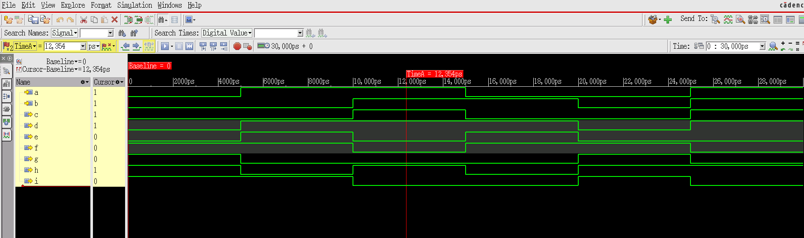

# Design 001: Basic Logic Gates

## Overview
This design implements all basic logic gates in a single Verilog module. It demonstrates the fundamental building blocks of digital logic circuits including AND, OR, XOR, NAND, NOR, XNOR, and NOT gates.

## Design Description
The `gates` module takes two input signals (`a` and `b`) and produces seven different output signals representing various logic operations.

### Module Interface
```verilog
module gates(
    input a, b,
    output c, d, e, f, g, h, i
);
```

### Logic Operations
- **c**: AND gate (`a & b`)
- **d**: OR gate (`a | b`) 
- **e**: XOR gate (`a ^ b`)
- **f**: NAND gate (`~(a & b)`)
- **g**: NOR gate (`~(a | b)`)
- **h**: XNOR gate (`~(a ^ b)`)
- **i**: NOT gate (`~b`)

## Files Description

### Source Files
- **`gates.v`** - Main design module implementing all basic logic gates
- **`gates_tb.v`** - Testbench for verifying the functionality of all gates

### Simulation Files
- **`xrun.history`** - Command history from Xcelium simulator runs
- **`simvision38839.diag`** - SimVision diagnostic log file
- **`waveform_xcelium.png`** - Waveform screenshot showing simulation results (captured from SimVision)

### Generated Files
- **`xcelium.d/`** - Xcelium compilation and simulation database directory

## Truth Table

| a | b | c (AND) | d (OR) | e (XOR) | f (NAND) | g (NOR) | h (XNOR) | i (NOT b) |
|---|---|---------|--------|---------|----------|---------|----------|-----------|
| 0 | 0 |    0    |   0    |    0    |    1     |    1    |    1     |     1     |
| 0 | 1 |    0    |   1    |    1    |    1     |    0    |    0     |     0     |
| 1 | 0 |    0    |   1    |    1    |    1     |    0    |    0     |     1     |
| 1 | 1 |    1    |   1    |    0    |    0     |    0    |    1     |     0     |

## Simulation Instructions

### Using Xcelium (Cadence)
```bash
# Compile and run simulation with GUI and waveform viewer
xrun gates.v gates_tb.v -access +rec -gui &

# Alternative command with timescale specification
xrun -timescale 1ns/1ps -gui +access+r gates.v gates_tb.v
```

**Note**: The `&` at the end runs the simulation in the background, allowing the waveform viewer to be invoked while keeping the terminal available.

### Testbench Sequence
The testbench applies the following input sequence:
1. `a=0, b=0` for 5ns
2. `a=1, b=0` for 5ns  
3. `a=1, b=1` for 5ns
4. `a=0, b=1` for 5ns
5. `a=0, b=0` for 5ns
6. `a=1, b=1` for 5ns
7. Finish simulation

## Waveform Analysis
The simulation generates comprehensive waveforms showing all gate outputs responding to the input stimulus. The waveform capture demonstrates the complete functionality of all logic gates:



**Waveform Analysis Points:**
- **Input Signals (a, b)**: Show the test sequence with clear transitions
- **AND Gate (c)**: High only when both inputs are high
- **OR Gate (d)**: High when either input is high
- **XOR Gate (e)**: High when inputs are different
- **NAND Gate (f)**: Inverted AND operation
- **NOR Gate (g)**: Inverted OR operation  
- **XNOR Gate (h)**: Inverted XOR operation
- **NOT Gate (i)**: Inverted input b

**Viewing Waveforms:**
1. Run: `xrun gates.v gates_tb.v -access +rec -gui &`
2. In SimVision, add all signals to the waveform viewer
3. Run the simulation to observe signal behavior
4. Use zoom and cursor tools to analyze timing relationships
5. Verify each gate's truth table against the waveform

## Key Learning Points
- Understanding basic logic gate operations
- Verilog continuous assignment using `assign` statements
- Bitwise operators in Verilog (`&`, `|`, `^`, `~`)
- Simple testbench structure with stimulus generation
- Waveform analysis for digital logic verification

## Design Features
- **Combinational Logic**: All outputs change immediately with input changes
- **Concurrent Operations**: All gates operate simultaneously
- **Complete Gate Set**: Covers all fundamental 2-input logic operations
- **Simple Interface**: Easy to understand and verify

## Simulation Environment
- **Simulator**: Xcelium (XM-Sim) version 25.03-s001
- **Timescale**: 1ns/1ps
- **Platform**: Linux/x86_64
- **Visualization**: SimVision waveform viewer

## Usage Notes
This design serves as a foundation for understanding:
- Digital logic fundamentals
- Verilog syntax and semantics
- Simulation and verification techniques
- Gate-level circuit behavior

Perfect for beginners learning digital design and Verilog HDL concepts.
