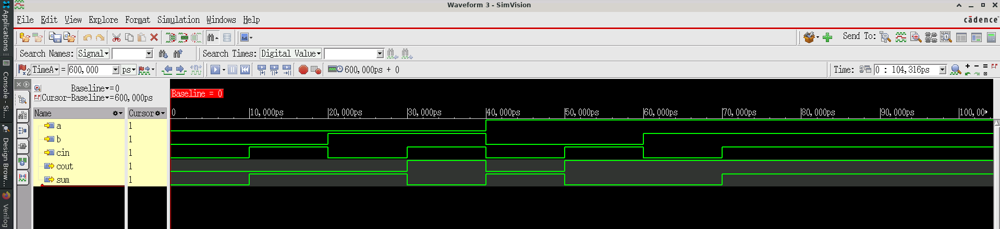

# Design 003 - Full Adder

## Overview
A full adder is a fundamental digital circuit that adds three 1-bit binary numbers: two operands (a, b) and a carry-in (cin). It produces a sum output and a carry-out (cout), making it essential for multi-bit arithmetic operations in digital systems.

## Truth Table
| a | b | cin | sum | cout |
|---|---|-----|-----|------|
| 0 | 0 |  0  |  0  |  0   |
| 0 | 0 |  1  |  1  |  0   |
| 0 | 1 |  0  |  1  |  0   |
| 0 | 1 |  1  |  0  |  1   |
| 1 | 0 |  0  |  1  |  0   |
| 1 | 0 |  1  |  0  |  1   |
| 1 | 1 |  0  |  0  |  1   |
| 1 | 1 |  1  |  1  |  1   |

## Design Implementation
The full adder uses a compact Verilog implementation with concatenation assignment:
```verilog
assign {cout,sum} = a + b + cin;
```
This approach leverages Verilog's automatic width extension and bit manipulation to generate both outputs simultaneously.

## Files Description
- `full_adder.v` - Main module implementing the full adder logic
- `full_adder_tb.v` - Comprehensive testbench covering all 8 input combinations
- `README.md` - This documentation file

## Module Interface
### Inputs
- `a` - First 1-bit operand
- `b` - Second 1-bit operand  
- `cin` - Carry input from previous stage

### Outputs
- `sum` - 1-bit sum result
- `cout` - Carry output to next stage

## Simulation
The testbench systematically tests all possible input combinations with 10ns delays between transitions. Each test case validates the correct sum and carry generation.

### Running Simulation (Xcelium)
```bash
xrun -timescale 1ns/1ps -gui +access+r full_adder.v full_adder_tb.v
```

### Waveform Analysis
The functional simulation waveform demonstrates complete verification of the full adder functionality:



**Waveform Analysis:**
- **Input Sequence**: Systematic progression through all 8 input combinations (000 → 111)
- **Output Behavior**: Correct sum and carry generation for each test case
- **Timing Analysis**: 10ns intervals between input changes with immediate output response
- **Verification**: Visual confirmation that hardware matches expected truth table behavior

Key signals to observe:
- Input transitions: a, b, cin
- Output responses: sum, cout  
- Functional correctness across all test vectors

## Applications
- Building blocks for multi-bit adders (ripple carry, carry lookahead)
- ALU implementation in processors
- Binary arithmetic operations
- Digital signal processing circuits

## Key Features
- Minimalistic design using behavioral modeling
- Complete input coverage in testbench
- Efficient single-line logic implementation
- Industry-standard module interface
