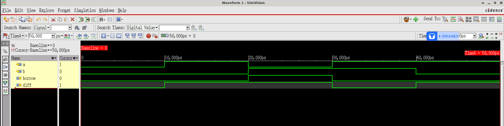

# Design 004 - Half Subtractor

## Overview
A half subtractor is a combinational logic circuit that performs subtraction of two single-bit binary numbers. It has two inputs (minuend `a` and subtrahend `b`) and produces two outputs: the difference (`diff`) and borrow (`borrow`).

## Truth Table
| a | b | diff | borrow |
|---|---|------|--------|
| 0 | 0 |  0   |   0    |
| 0 | 1 |  1   |   1    |
| 1 | 0 |  1   |   0    |
| 1 | 1 |  0   |   0    |

## Logic Functions
- **Difference (diff)**: `diff = a ⊕ b` (XOR gate)
- **Borrow**: `borrow = b̄ ∧ ā = b & (~a)` (b AND NOT a)

## Module Interface
```verilog
module half_sub(
    input a,     // Minuend
    input b,     // Subtrahend  
    output diff, // Difference
    output borrow // Borrow output
);
```

## Implementation
The design uses simple assign statements:
- `assign diff = a^b;` - XOR operation for difference
- `assign borrow = b & (~a);` - Borrow logic

## Files
- `half_sub.v` - Main half subtractor module
- `half_sub_tb.v` - Testbench with comprehensive test cases
- `simvision156527.diag` - SimVision diagnostic log file
- `xrun.history` - Xcelium simulation command history
- `README.md` - This documentation file

## Simulation

### Cadence Xcelium Simulation
The design has been verified using **Cadence Xcelium 25.03-s001** simulator with the following command:
```bash
xrun -timescale 1ns/1ps +access+r -gui half_sub.v half_sub_tb.v
```

### Test Coverage
The testbench covers all possible input combinations:
- (a=0, b=0) → diff=0, borrow=0
- (a=0, b=1) → diff=1, borrow=1  
- (a=1, b=0) → diff=1, borrow=0
- (a=1, b=1) → diff=0, borrow=0

### Simulation Environment
- **Simulator**: Cadence Xcelium (xmsim 64-bit)
- **Version**: 25.03-s001
- **Timescale**: 1ns/1ps
- **Platform**: Linux/x86_64
- **GUI**: SimVision for waveform visualization

## Functional Simulation Waveform

*Cadence Xcelium functional simulation waveform showing half subtractor input/output behavior*

## Expected Waveform
```
Time:    0ns   10ns   20ns   30ns   40ns   50ns
       ┌─────┬─────┬─────┬─────┬─────┬─────
a      │  0  │  1  │  0  │  1  │  1  │
       └─────┴─────┴─────┴─────┴─────┴─────
       ┌─────┬─────┬─────┬─────┬─────┬─────
b      │  0  │  0  │  1  │  1  │  0  │
       └─────┴─────┴─────┴─────┴─────┴─────
       ┌─────┬─────┬─────┬─────┬─────┬─────
diff   │  0  │  1  │  1  │  0  │  1  │
       └─────┴─────┴─────┴─────┴─────┴─────
       ┌─────┬─────┬─────┬─────┬─────┬─────
borrow │  0  │  0  │  1  │  0  │  0  │
       └─────┴─────┴─────┴─────┴─────┴─────
```

## Key Points
- Half subtractor can only subtract single bits
- Borrow output indicates when the subtrahend is greater than minuend
- For multi-bit subtraction, full subtractors are cascaded
- Essential building block in arithmetic logic units (ALUs)

## Applications
- Binary arithmetic operations
- Digital calculators
- Arithmetic Logic Units (ALUs)
- Computer processors
- Digital signal processing circuits
