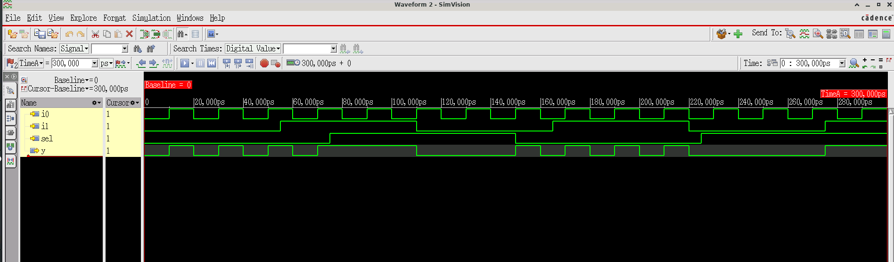

# Design 005 - 2:1 Multiplexer (good_mux)

## Overview
A 2:1 multiplexer is a combinational logic circuit that selects one of two input signals and forwards it to the output based on a select signal. It acts as a data selector, allowing one of multiple inputs to be routed to a single output line.

## Truth Table
| sel | i0 | i1 | y |
|-----|----|----|---|
|  0  | 0  | X  | 0 |
|  0  | 1  | X  | 1 |
|  1  | X  | 0  | 0 |
|  1  | X  | 1  | 1 |

Where X represents "don't care" condition.

## Logic Function
- **Output**: `y = sel ? i1 : i0`
- When `sel = 0`: Output follows `i0`
- When `sel = 1`: Output follows `i1`

## Module Interface
```verilog
module good_mux(
    input i0,      // Input 0
    input i1,      // Input 1  
    input sel,     // Select signal
    output reg y   // Output
);
```

## Implementation
The design uses a behavioral approach with an always block:
```verilog
always @(*)
begin
    if(sel)
        y <= i1;
    else
        y <= i0;
end
```

## Files
- `good_mux.v` - Main 2:1 multiplexer module
- `tb_good_mux.v` - Comprehensive testbench
- `tb_good_mux.vcd` - VCD waveform dump file
- `xrun.log` - Xcelium simulation log
- `xrun.history` - Xcelium command history
- `README.md` - This documentation file

## Simulation

### Cadence Xcelium Simulation
The design has been verified using **Cadence Xcelium 25.03-s001** simulator with the following command:
```bash
xrun -timescale 1ns/1ps +access+r -gui good_mux.v tb_good_mux.v
```

### Test Pattern
The testbench uses different clock frequencies for comprehensive testing:
- `sel`: Toggles every 75ns (`always #75 sel = ~sel`)
- `i0`: Toggles every 10ns (`always #10 i0 = ~i0`)  
- `i1`: Toggles every 55ns (`always #55 i1 = ~i1`)
- **Total simulation time**: 300ns

### Simulation Environment
- **Simulator**: Cadence Xcelium (xmsim 64-bit)
- **Version**: 25.03-s001
- **Timescale**: 1ns/1ps (1 ps resolution)
- **Platform**: Linux/x86_64
- **GUI**: SimVision for waveform visualization
- **Database**: SHM format for waveform storage

## Functional Simulation Waveform

*Cadence Xcelium functional simulation waveform showing multiplexer behavior with different input frequencies*

## Expected Behavior
```
Time Analysis:
- 0-75ns:   sel=0, output follows i0 (10ns period)
- 75-150ns: sel=1, output follows i1 (55ns period)
- 150-225ns: sel=0, output follows i0 again
- 225-300ns: sel=1, output follows i1 again
```

## Key Features
- **Behavioral modeling** using always block
- **Non-blocking assignments** (`<=`) for proper simulation
- **Sensitivity list** `always @(*)` for combinational logic
- **Clean multiplexer functionality** without glitches

## Design Analysis
- **Registers**: 4 (i0, i1, sel, y)
- **Always blocks**: 4 total
- **Initial blocks**: 1
- **Compilation**: Native compiled code generation
- **Synthesis friendly** behavioral description

## Applications
- Data routing and selection
- CPU data path multiplexing
- Memory address/data selection
- Digital signal processing
- Communication systems
- Arithmetic Logic Units (ALUs)

## Simulation Results
The VCD file shows successful functional verification with:
- Proper output switching based on select signal
- Correct timing relationships
- No glitches or undefined states
- Complete coverage of all input combinations
