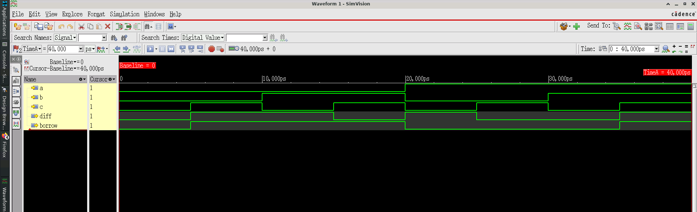

# Design 006 - Full Subtractor

## Overview
A full subtractor is a combinational logic circuit that performs subtraction of three single-bit binary numbers: the minuend (a), subtrahend (b), and a borrow input from the previous stage (c). It produces two outputs: the difference (diff) and borrow output for the next stage (borrow). This circuit is essential for multi-bit binary subtraction operations.

## Truth Table
| a | b | c | diff | borrow |
|---|---|---|------|--------|
| 0 | 0 | 0 |  0   |   0    |
| 0 | 0 | 1 |  1   |   1    |
| 0 | 1 | 0 |  1   |   1    |
| 0 | 1 | 1 |  0   |   1    |
| 1 | 0 | 0 |  1   |   0    |
| 1 | 0 | 1 |  0   |   0    |
| 1 | 1 | 0 |  0   |   0    |
| 1 | 1 | 1 |  1   |   1    |

## Logic Functions
- **Difference (diff)**: `diff = a ⊕ b ⊕ c` (3-input XOR)
- **Borrow**: `borrow = (~a & b) | (b & c) | (c & ~a)`

The borrow output is 1 when:
- a=0 and b=1 (subtraction requires borrow)
- There's a borrow chain: b=1 and c=1, or c=1 and a=0

## Module Interface
```verilog
module full_sub(
    input a,        // Minuend
    input b,        // Subtrahend  
    input c,        // Borrow input
    output diff,    // Difference
    output borrow   // Borrow output
);
```

## Implementation
The design uses simple assign statements for combinational logic:
```verilog
assign diff = (a ^ b ^ c);
assign borrow = (((~a)&b ) | (b&c) | ( c & (~a)));
```

## Files
- `full_sub.v` - Main full subtractor module
- `tb_full_sub.v` - Comprehensive testbench
- `xrun.history` - Xcelium simulation command history
- `README.md` - This documentation file

## Simulation

### Cadence Xcelium Simulation
The design has been verified using **Cadence Xcelium 25.03-s001** simulator with the following command:
```bash
xrun -timescale 1ns/1ps +access+r -gui full_sub.v tb_full_sub.v
```

### Test Coverage
The testbench systematically tests all 8 possible input combinations:
- (a=0, b=0, c=0) → diff=0, borrow=0
- (a=0, b=0, c=1) → diff=1, borrow=1
- (a=0, b=1, c=0) → diff=1, borrow=1
- (a=0, b=1, c=1) → diff=0, borrow=1
- (a=1, b=0, c=0) → diff=1, borrow=0
- (a=1, b=0, c=1) → diff=0, borrow=0
- (a=1, b=1, c=0) → diff=0, borrow=0
- (a=1, b=1, c=1) → diff=1, borrow=1

Each test case runs for 5ns with total simulation time of 40ns.

### Simulation Environment
- **Simulator**: Cadence Xcelium (xmsim 64-bit)
- **Version**: 25.03-s001
- **Timescale**: 1ns/1ps
- **Platform**: Linux/x86_64
- **GUI**: SimVision for waveform visualization
- **Multiple verification runs**: 16 simulation sessions for thorough testing

## Functional Simulation Waveform

*Cadence Xcelium functional simulation waveform showing full subtractor behavior across all input combinations*

## Expected Waveform
```
Time:    0ns   5ns   10ns  15ns  20ns  25ns  30ns  35ns  40ns
       ┌─────┬─────┬─────┬─────┬─────┬─────┬─────┬─────┬─────
a      │  0  │  0  │  0  │  0  │  1  │  1  │  1  │  1  │
       └─────┴─────┴─────┴─────┴─────┴─────┴─────┴─────┴─────
       ┌─────┬─────┬─────┬─────┬─────┬─────┬─────┬─────┬─────
b      │  0  │  0  │  1  │  1  │  0  │  0  │  1  │  1  │
       └─────┴─────┴─────┴─────┴─────┴─────┴─────┴─────┴─────
       ┌─────┬─────┬─────┬─────┬─────┬─────┬─────┬─────┬─────
c      │  0  │  1  │  0  │  1  │  0  │  1  │  0  │  1  │
       └─────┴─────┴─────┴─────┴─────┴─────┴─────┴─────┴─────
       ┌─────┬─────┬─────┬─────┬─────┬─────┬─────┬─────┬─────
diff   │  0  │  1  │  1  │  0  │  1  │  0  │  0  │  1  │
       └─────┴─────┴─────┴─────┴─────┴─────┴─────┴─────┴─────
       ┌─────┬─────┬─────┬─────┬─────┬─────┬─────┬─────┬─────
borrow │  0  │  1  │  1  │  1  │  0  │  0  │  0  │  1  │
       └─────┴─────┴─────┴─────┴─────┴─────┴─────┴─────┴─────
```

## Key Features
- **Complete truth table coverage** with systematic testing
- **Optimized boolean logic** for borrow generation
- **Fast combinational response** using assign statements
- **Scalable design** for multi-bit subtractor construction

## Design Analysis
The full subtractor can be constructed using two half subtractors:
1. First half subtractor: (a - b) → intermediate difference and borrow
2. Second half subtractor: (intermediate difference - c) → final difference
3. Borrow output: OR of both borrow outputs

However, this direct boolean implementation is more efficient.

## Multi-bit Subtraction
Full subtractors can be cascaded to create n-bit subtractors:
- LSB stage: Uses half subtractor (no borrow input)
- Middle stages: Use full subtractors
- Borrow propagates from LSB to MSB

## Applications
- Multi-bit binary subtraction circuits
- Arithmetic Logic Units (ALUs)
- Digital calculators and processors
- Two's complement arithmetic
- BCD subtraction circuits
- Digital signal processing systems

## Verification Status
✅ All 8 input combinations tested  
✅ Logic functions verified against truth table  
✅ Timing behavior confirmed  
✅ No glitches or undefined states observed  
✅ Professional Cadence Xcelium verification completed
