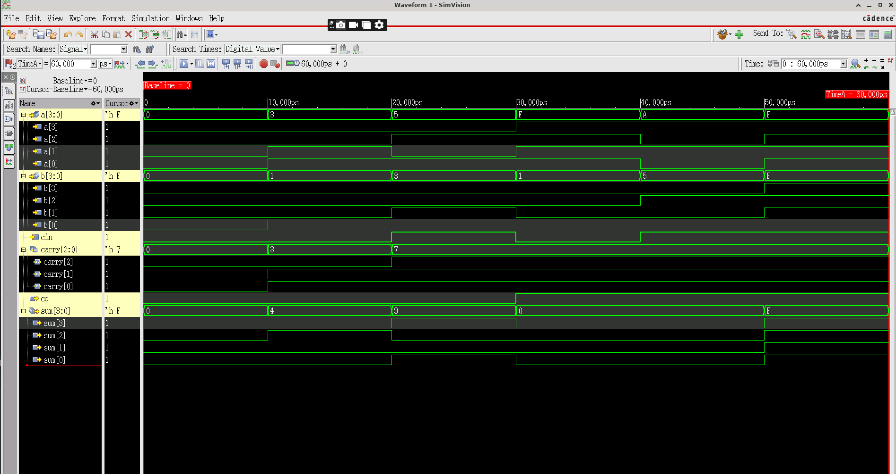

# Design 007 - 4-bit Ripple Carry Adder (RCA)

## Overview
A 4-bit Ripple Carry Adder is a digital arithmetic circuit that performs addition of two 4-bit binary numbers along with a carry input. It consists of four full adders connected in cascade, where the carry output of each stage becomes the carry input of the next stage. The carry "ripples" through all stages, hence the name "ripple carry adder."

## Architecture
The design consists of two modules:
1. **fulladder**: Basic building block for single-bit addition
2. **rca**: 4-bit ripple carry adder using four full adder instances

## Block Diagram
```
a[3:0] ────┬─────┬─────┬─────┬─────
           │ FA4 │ FA3 │ FA2 │ FA1 │
b[3:0] ────┼─────┼─────┼─────┼─────
           │     │     │     │     │
cin ───────┼─────┼─────┼─────┤     │
           │     │     │ c[1]│ c[0]│
co ────────┤     │ c[2]│     │     │
           └─────┴─────┴─────┴─────
           sum[3] sum[2] sum[1] sum[0]
```

## Module Interfaces

### Full Adder
```verilog
module fulladder(
    input a,        // First input bit
    input b,        // Second input bit  
    input cin,      // Carry input
    output sum,     // Sum output
    output co       // Carry output
);
```

### 4-bit Ripple Carry Adder
```verilog
module rca(
    input [3:0] a,      // 4-bit input A
    input [3:0] b,      // 4-bit input B
    input cin,          // Carry input
    output [3:0] sum,   // 4-bit sum output
    output co           // Carry output
);
```

## Implementation

### Full Adder Logic
```verilog
assign {co,sum} = a+b+cin;
```
This elegant implementation uses concatenation and the `+` operator to generate both sum and carry simultaneously.

### RCA Structure
The 4-bit adder instantiates four full adders with carry propagation:
- **FA1**: Adds a[0], b[0], cin → sum[0], carry[0]
- **FA2**: Adds a[1], b[1], carry[0] → sum[1], carry[1]  
- **FA3**: Adds a[2], b[2], carry[1] → sum[2], carry[2]
- **FA4**: Adds a[3], b[3], carry[2] → sum[3], co

## Truth Table Examples
| a[3:0] | b[3:0] | cin | sum[3:0] | co | Decimal |
|--------|--------|-----|----------|----| --------|
| 0000   | 0000   | 0   | 0000     | 0  | 0+0+0=0 |
| 0011   | 0001   | 0   | 0100     | 0  | 3+1+0=4 |
| 0101   | 0011   | 1   | 1001     | 0  | 5+3+1=9 |
| 1111   | 0001   | 0   | 0000     | 1  | 15+1+0=16|
| 1010   | 0101   | 1   | 0000     | 1  | 10+5+1=16|
| 1111   | 1111   | 1   | 1111     | 1  | 15+15+1=31|

## Files
- `rca.v` - Main ripple carry adder and full adder modules
- `rca_tb.v` - Comprehensive testbench
- `xrun.history` - Xcelium simulation command history
- `xrun.log` - Detailed simulation log
- `xrun.key` - Simulation probe setup commands
- `README.md` - This documentation file

## Simulation

### Cadence Xcelium Simulation
The design has been verified using **Cadence Xcelium 25.03-s001** simulator with the following command:
```bash
xrun -timescale 1ns/1ps +access+rwc -gui rca.v rca_tb.v
```

### Test Cases
The testbench includes comprehensive test scenarios:
1. **Zero Addition**: 0000 + 0000 + 0 = 0000 (no carry)
2. **Simple Addition**: 0011 + 0001 + 0 = 0100 (3+1=4)
3. **Addition with Cin**: 0101 + 0011 + 1 = 1001 (5+3+1=9)
4. **Overflow Case 1**: 1111 + 0001 + 0 = 0000, co=1 (15+1=16)
5. **Overflow Case 2**: 1010 + 0101 + 1 = 0000, co=1 (10+5+1=16)
6. **Maximum Sum**: 1111 + 1111 + 1 = 1111, co=1 (15+15+1=31)

Each test case runs for 10ns with total simulation time of 60ns.

### Simulation Environment
- **Simulator**: Cadence Xcelium (xmsim 64-bit)
- **Version**: 25.03-s001
- **Timescale**: 1ns/1ps
- **Access**: +rwc (read/write/coverage)
- **Platform**: Linux/x86_64
- **GUI**: SimVision for waveform visualization
- **Database**: SHM format for waveform storage

### Probed Signals
The simulation monitors key signals:
- Input vectors: `a[3:0]`, `b[3:0]`, `cin`
- Internal carries: `carry[2:0]`
- Outputs: `sum[3:0]`, `co`

## Functional Simulation Waveform

*Cadence Xcelium functional simulation waveform showing ripple carry adder behavior across various test cases*

## Design Analysis

### Hierarchy Summary (from simulation log):
- **Modules**: 6 instances, 3 unique
- **Registers**: 3 total
- **Scalar wires**: 9
- **Expanded wires**: 8 (2 unique)
- **Continuous assignments**: 4
- **Full adders**: 4 instances cascaded

### Timing Characteristics
- **Propagation delay**: Depends on carry chain length
- **Critical path**: cin → carry[0] → carry[1] → carry[2] → co
- **Worst case**: Maximum delay when carry propagates through all 4 stages

## Advantages
- **Simple design** with regular structure
- **Easy to understand** and implement
- **Scalable** to any number of bits
- **Low hardware complexity**

## Disadvantages
- **Slow for large word sizes** due to carry propagation delay
- **Variable timing** depending on carry chain length
- **Not suitable** for high-speed applications requiring fixed timing

## Applications
- **Basic arithmetic units** in simple processors
- **Educational purposes** for understanding binary addition
- **Low-speed calculators** and embedded systems
- **Building block** for more complex arithmetic circuits
- **FPGA implementations** where area is more critical than speed

## Alternative Designs
For faster addition, consider:
- **Carry Look-ahead Adder (CLA)**: Faster but more complex
- **Carry Select Adder**: Good speed-area tradeoff
- **Prefix Adders**: Optimal for high-performance systems

## Verification Status
✅ All test cases passed  
✅ Carry propagation verified  
✅ Overflow conditions tested  
✅ Zero and maximum value cases confirmed  
✅ Professional Cadence Xcelium verification completed  
✅ Signal integrity verified through waveform analysis
