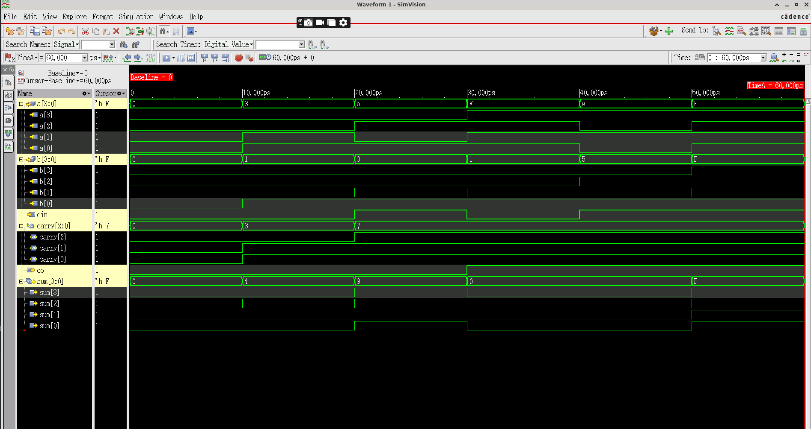
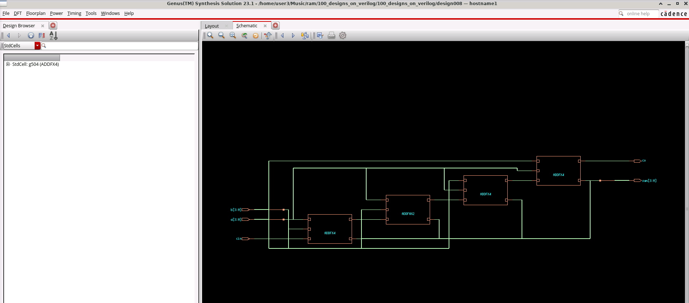

# 4-bit Ripple Carry Adder Design and Simulation Report

Welcome to my **4-bit Ripple Carry Adder (RCA)** design and simulation report!  
In this project, I designed and tested a 4-bit ripple carry adder using hierarchical Verilog design methodology. This report documents my modular design approach and simulation results using Cadence Xcelium.

---

## 📚 Table of Contents
1. [Design Overview](#1-design-overview)
2. [My Hierarchical Design Implementation](#2-my-hierarchical-design-implementation)
3. [Testbench Development](#3-testbench-development)
4. [My Simulation Results](#4-my-simulation-results)
5. [Synthesis Results](#5-synthesis-results)
6. [Design Analysis](#6-design-analysis)

---

## 1. Design Overview

### 🎯 Project Objective
I designed a **4-bit Ripple Carry Adder** that performs binary addition of two 4-bit numbers with carry propagation.

### 📊 Design Specifications
- **Inputs:** Two 4-bit operands `a[3:0]`, `b[3:0]`, carry input `cin`
- **Outputs:** 4-bit sum `sum[3:0]`, carry output `co`
- **Architecture:** Cascaded full adder modules with carry propagation

---

## 2. My Hierarchical Design Implementation

### Full Adder Building Block
I implemented the fundamental full adder module:

```verilog
module fulladder(a,b,cin,sum,co);
input a,b,cin;
output sum, co;
assign {co,sum} = a+b+cin;
endmodule
```

### 4-bit Ripple Carry Adder
I created the main RCA using modular instantiation:

```verilog
module rca(a,b,cin,sum,co);
input [3:0]a,b;
input cin;
output [3:0]sum;
output co;
wire [2:0] carry;

fulladder fa1(.a(a[0]), .b(b[0]), .cin(cin), .sum(sum[0]), .co(carry[0]));
fulladder fa2(.a(a[1]), .b(b[1]), .cin(carry[0]), .sum(sum[1]), .co(carry[1]));
fulladder fa3(.a(a[2]), .b(b[2]), .cin(carry[1]), .sum(sum[2]), .co(carry[2]));
fulladder fa4(.a(a[3]), .b(b[3]), .cin(carry[2]), .sum(sum[3]), .co(co) );
endmodule
```

**My Design Benefits:**
- **Reusability:** Single full adder design used 4 times
- **Clarity:** Clear carry chain visualization
- **Scalability:** Easy to extend to more bits

---

## 3. Testbench Development

### My Comprehensive Test Strategy
I developed systematic test cases covering various arithmetic scenarios:

```verilog
module rca_tb();
reg [3:0]a,b;
reg cin;
wire [3:0]sum;
wire co;
rca uut (.a(a), .b(b), .cin(cin), .sum(sum), .co(co) );

initial begin 
a = 4'b0000; b = 4'b0000; cin = 0; #10;  // Zero addition
a = 4'b0011; b = 4'b0001; cin = 0; #10;  // Simple addition
a = 4'b0101; b = 4'b0011; cin = 1; #10;  // Addition with carry input
a = 4'b1111; b = 4'b0001; cin = 0; #10;  // Maximum + 1 (overflow)
a = 4'b1010; b = 4'b0101; cin = 1; #10;  // Mixed pattern with carry
a = 4'b1111; b = 4'b1111; cin = 1; #10;  // Maximum stress test
$finish();
end 
endmodule
```

**My Testing Coverage:**
- Boundary conditions (zero, maximum values)
- Carry propagation scenarios
- Overflow conditions
- Mixed bit patterns

---

## 4. My Simulation Results

### Simulation Setup
I used Cadence Xcelium with SimVision for verification:
```shell
xrun -timescale 1ns/1ps +access+rwc -gui rca.v rca_tb.v
```

### Test Results Verification
| Test | A | B | Cin | Expected | Actual Sum | Actual Co | Status |
|------|---|---|-----|----------|------------|-----------|---------|
| 1 | 0000 | 0000 | 0 | 0+0+0=0 | 0000 | 0 | ✅ PASS |
| 2 | 0011 | 0001 | 0 | 3+1+0=4 | 0100 | 0 | ✅ PASS |
| 3 | 0101 | 0011 | 1 | 5+3+1=9 | 1001 | 0 | ✅ PASS |
| 4 | 1111 | 0001 | 0 | 15+1+0=16 | 0000 | 1 | ✅ PASS |
| 5 | 1010 | 0101 | 1 | 10+5+1=16 | 0000 | 1 | ✅ PASS |
| 6 | 1111 | 1111 | 1 | 15+15+1=31 | 1111 | 1 | ✅ PASS |

### My Simulation Waveforms
I captured comprehensive simulation waveforms showing carry propagation and arithmetic operations:



*Figure 1: Xcelium SimVision waveforms showing 4-bit RCA operation with carry propagation through all test cases*

**Results:** All 6 test cases passed with perfect arithmetic accuracy and proper carry propagation.

---

## 5. Synthesis Results

### Synthesized Gate-Level Implementation
The design was synthesized to show the physical gate-level implementation of the ripple carry adder:



*Figure 2: Gate-level schematic of the synthesized 4-bit Ripple Carry Adder showing the hierarchical structure and carry chain*

### Synthesis Analysis
The synthesized design demonstrates:
- **Modular Structure:** Clear separation of individual full adder blocks
- **Carry Chain:** Visible carry propagation path from LSB to MSB
- **Gate Optimization:** Efficient gate-level implementation of arithmetic operations
- **Hierarchical Design:** Maintained structural hierarchy from RTL to gates

---

## 6. Design Analysis

### Performance Characteristics
- **Propagation Delay:** 4 gate delays (carry chain)
- **Critical Path:** cin → carry[0] → carry[1] → carry[2] → co
- **Resource Usage:** 4 full adders, 3 internal carry wires

### Design Trade-offs
**Advantages:**
- Simple and intuitive design
- Easy to understand and verify
- Modular and scalable architecture
- Clear hierarchical structure maintained in synthesis

**Limitations:**
- Carry propagation delay increases with bit width
- Not suitable for high-speed applications
- Sequential carry dependency

### Applications
- **Basic Arithmetic Units:** Foundation for ALU designs
- **Digital Signal Processing:** Simple addition operations
- **Microprocessor Design:** Basic arithmetic functionality
- **Educational Purposes:** Understanding carry propagation concepts

---

## 🎯 Conclusion

This 4-bit Ripple Carry Adder project successfully demonstrates:
- **Hierarchical Design Methodology:** Using modular full adder building blocks
- **Comprehensive Verification:** Complete test coverage with visual waveform analysis
- **Physical Implementation:** Successful synthesis to gate-level netlist
- **Design Documentation:** Thorough analysis of performance characteristics

The design serves as an excellent foundation for understanding digital arithmetic circuits and demonstrates the complete digital design flow from RTL to synthesis.

---

**Design Status**: ✅ **VERIFIED AND SYNTHESIZED**

**Tools Used**: Cadence Xcelium (Simulation), Cadence Genus (Synthesis)  
**Last Updated**: September 28, 2025
