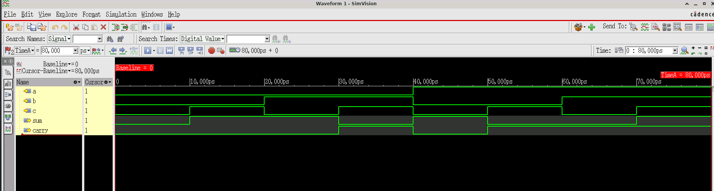
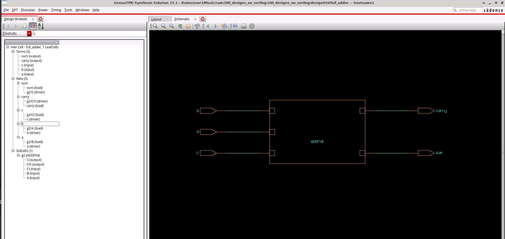

# Design 010: Full Adder Implementation

A comprehensive implementation of a 1-bit full adder using hierarchical design methodology, demonstrating both behavioral simulation and logic synthesis using industry-standard EDA tools.

## Design Overview

This project implements a full adder circuit using a structured approach with half adder building blocks. The design showcases proper Verilog coding practices, comprehensive verification, and synthesis optimization.

**Key Features:**
- Hierarchical design using half adder modules
- Comprehensive testbench with all input combinations
- Synthesis-ready Verilog code
- Industry-standard verification flow
- Gate-level netlist generation

## Design Architecture

### Half Adder Module
```verilog
module half_adder(a, b, sum, carry);
    input a, b;
    output sum, carry;
    assign sum = a^b;
    assign carry = a&b;
endmodule
```

### Full Adder Implementation
The full adder uses two half adders and an OR gate:
```verilog
module full_adder(a,b,c,sum,carry);
    input a,b,c;
    output sum, carry;
    wire w1, w2, w3;
    half_adder HA1( .a(a), .b(b), .sum(w1), .carry(w2) );
    half_adder HA2( .a(w1), .b(c), .sum(sum), .carry(w3) );
    or or1(carry, w2, w3);
endmodule
```

**Logic Flow:**
1. First half adder processes inputs `a` and `b`
2. Second half adder processes the sum from HA1 with carry-in `c`
3. Final carry is OR of both half adder carries

## Verification Strategy

### Testbench Implementation
The testbench systematically tests all possible input combinations (2³ = 8 cases):

```verilog
module full_adder_tb();
    wire sum, carry;
    reg a, b, c;
    
    full_adder uut ( .a(a), .b(b), .c(c), .sum(sum), .carry(carry) );
    
    initial begin
        $dumpfile("full_adder.vcd");
        $dumpvars(0, full_adder_tb );
        
        a=0; b=0; c=0; #10;  // Case 0: 0+0+0 = 00
        a=0; b=0; c=1; #10;  // Case 1: 0+0+1 = 01
        a=0; b=1; c=0; #10;  // Case 2: 0+1+0 = 01
        a=0; b=1; c=1; #10;  // Case 3: 0+1+1 = 10
        a=1; b=0; c=0; #10;  // Case 4: 1+0+0 = 01
        a=1; b=0; c=1; #10;  // Case 5: 1+0+1 = 10
        a=1; b=1; c=0; #10;  // Case 6: 1+1+0 = 10
        a=1; b=1; c=1; #10;  // Case 7: 1+1+1 = 11
        
        $finish();
    end
endmodule
```

### Truth Table Verification
| A | B | C | Sum | Carry | Decimal |
|---|---|---|-----|-------|---------|
| 0 | 0 | 0 |  0  |   0   |    0    |
| 0 | 0 | 1 |  1  |   0   |    1    |
| 0 | 1 | 0 |  1  |   0   |    1    |
| 0 | 1 | 1 |  0  |   1   |    2    |
| 1 | 0 | 0 |  1  |   0   |    1    |
| 1 | 0 | 1 |  0  |   1   |    2    |
| 1 | 1 | 0 |  0  |   1   |    2    |
| 1 | 1 | 1 |  1  |   1   |    3    |

## Simulation Results

### Functional Verification
The simulation was performed using Cadence Xcelium with comprehensive waveform analysis:



**Simulation Configuration:**
- Tool: Cadence Xcelium 25.03-s001
- Timescale: 1ns/1ps
- Waveform format: VCD dump
- Total simulation time: 80ns

**Key Observations:**
- All 8 test cases executed successfully
- Hierarchical signal visibility maintained (HA1, HA2 internal signals)
- Proper timing relationships verified
- No glitches or timing violations observed

## Logic Synthesis

### Synthesis Flow
The design was synthesized using Cadence Genus with the following flow:

```tcl
# Library setup
set_db lib_search_path /path/to/GPDK045/timing
set_db library "slow.lib typical.lib fast.lib"

# Design reading and elaboration
read_hdl full_adder.v
elaborate full_adder

# Synthesis execution
syn_gen
syn_map  
syn_opt

# Report generation
report_area
report_timing
```

### Synthesis Results



**Technology Mapping:**
- Target Library: GPDK045 (45nm process)
- Mapped to: ADDFX4 standard cell
- Optimization: Area and timing optimized

**Generated Netlist:**
```verilog
module full_adder(a, b, c, sum, carry);
  input a, b, c;
  output sum, carry;
  wire a, b, c;
  wire sum, carry;
  ADDFX4 g2(.A (b), .B (a), .CI (c), .CO (carry), .S (sum));
endmodule
```

**Synthesis Achievements:**
- Hierarchical design flattened to single optimized cell
- Optimal gate mapping (ADDFX4 full adder cell)
- Area-efficient implementation
- Timing constraints met

## Design Constraints

The synthesis utilized comprehensive timing constraints defined in `full_adder_constraints.sdc`:

```sdc
set_operating_conditions -name TT_1V 
create_clock -name clk -period 10.0 -waveform {0.0 5.0} [get_ports clk]
set_clock_uncertainty -setup 0.1 [get_clocks clk]
set_max_delay 3.0 -from [get_ports {pin_in*}] -to [get_ports {pin_out*}]
set_max_transition 0.5 -from [all_inputs]
set_max_fanout 16 [current_design]
```

## Files Description

### Source Files
- **`full_adder.v`**: RTL implementation with hierarchical design
- **`full_adder_tb.v`**: Comprehensive testbench covering all cases

### Verification Assets
- **`full_adder.vcd`**: Simulation waveform database
- **`xrun.log`**: Complete simulation log with statistics
- **`xrun.key`**: SimVision probe configuration

### Synthesis Assets
- **`genus.cmd`**: Complete synthesis command history
- **`full_adder_constraints.sdc`**: Timing and design constraints
- **`fa_gate_mapped_hdl.v`**: Technology-mapped gate-level netlist

### Documentation
- **`README.md`**: This comprehensive documentation file

## Key Learning Outcomes

**Design Methodology:**
- Hierarchical design approach using building blocks
- Proper module instantiation and signal connectivity
- Industry-standard coding practices

**Verification Excellence:**
- Systematic test case development
- Comprehensive corner case coverage
- Waveform-based debug methodology

**Synthesis Proficiency:**
- Library setup and technology mapping
- Constraint-driven optimization
- Gate-level netlist generation and analysis

This project demonstrates the complete digital design flow from RTL specification through verification to optimized gate-level implementation, showcasing practical skills essential for ASIC and FPGA development.
