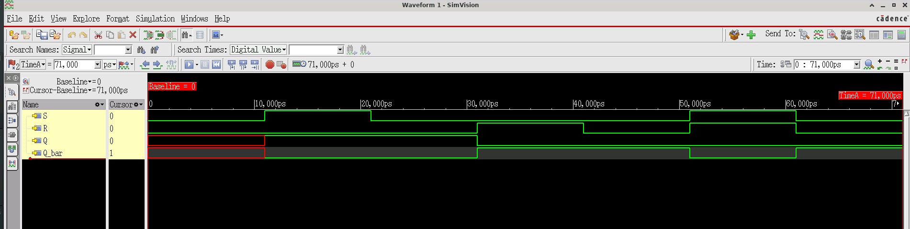

# SR Latch

## Overview
SR (Set-Reset) latch implemented using cross-coupled NOR gates in Verilog.

## Truth Table

| S | R | Q | Q_bar | State |
|---|---|---|-------|-------|
| 0 | 0 | Q | Q̄ | Hold |
| 0 | 1 | 0 | 1 | Reset |
| 1 | 0 | 1 | 0 | Set |
| 1 | 1 | X | X | Invalid |

## Simulation

### Running the Simulation

```bash
xrun -timescale 1ns/1ps +access+rwc -gui sr_latch.v tb_sr_latch.v
```

### Waveform



## Important Notes

⚠️ **Invalid State (S=1, R=1)**: Avoid setting both inputs high simultaneously - outputs become unpredictable.

## Implementation

```verilog
assign Q = ~(R | Q_bar);
assign Q_bar = ~(S | Q);
```

Cross-coupled NOR gates create feedback loop for state retention.
