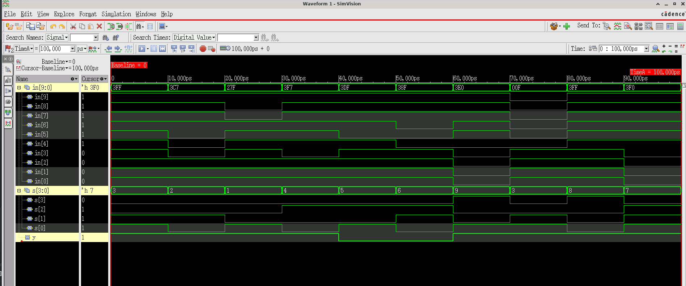

# 10x1 Multiplexer

## Overview
10-to-1 multiplexer implemented using hierarchical 2x1 multiplexers in Verilog.

## Block Diagram

```
Level 1: Five 2x1 MUXes (s[0])
  in[0:1] → MUX → m
  in[2:3] → MUX → n
  in[4:5] → MUX → o
  in[6:7] → MUX → p
  in[8:9] → MUX → q

Level 2: Two 2x1 MUXes (s[1])
  m,n → MUX → r
  o,p → MUX → z

Level 3: One 2x1 MUX (s[2])
  r,z → MUX → t

Level 4: One 2x1 MUX (s[3])
  t,q → MUX → y
```

## Module: `mux10`

### Ports
| Port | Direction | Width | Description |
|------|-----------|-------|-------------|
| in   | Input     | 10-bit | Input data lines [9:0] |
| s    | Input     | 4-bit  | Select lines [3:0] |
| y    | Output    | 1-bit  | Selected output |

### Functionality

Selects one of 10 input lines based on 4-bit select signal:

| Select (s) | Output (y) |
|------------|------------|
| 4'd0       | in[0]      |
| 4'd1       | in[1]      |
| 4'd2       | in[2]      |
| 4'd3       | in[3]      |
| 4'd4       | in[4]      |
| 4'd5       | in[5]      |
| 4'd6       | in[6]      |
| 4'd7       | in[7]      |
| 4'd8       | in[8]      |
| 4'd9       | in[9]      |

## Implementation

Uses a tree structure of 2x1 multiplexers:
- **Level 1**: 5 MUXes select between pairs of inputs using s[0]
- **Level 2**: 2 MUXes combine Level 1 outputs using s[1]
- **Level 3**: 1 MUX combines Level 2 outputs using s[2]
- **Level 4**: 1 MUX selects between Level 3 output and in[8:9] using s[3]

### Basic 2x1 MUX Module

```verilog
module mux (
    input a, b,
    input s,
    output y
);
    assign y = (s ? b : a);
endmodule
```

## Directory Structure

```
10x1_mux/
├── 10x1_mux.v                              # Main design file
├── 10x1_mux_tb.v                           # Testbench
├── 10x1_using_2x1mux_xcelium_waveform.png  # Simulation waveform
└── README.md                               # This file
```

## Simulation

### Running the Simulation

```bash
xrun -timescale 1ns/1ps +access+rwc -gui 10x1_mux.v 10x1_mux_tb.v
```

### Waveform



## Design Features

- ✅ Hierarchical design using basic 2x1 MUX building blocks
- ✅ Scalable architecture
- ✅ Clear signal propagation path
- ✅ Efficient tree structure minimizes delay

## Notes

⚠️ Select values > 9 will produce undefined behavior as only 10 inputs are available.
