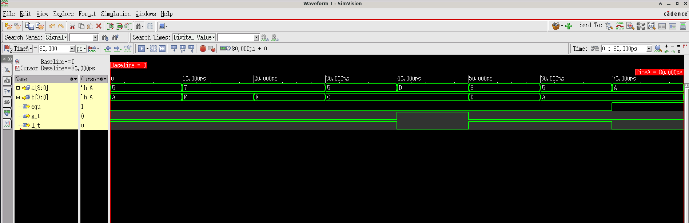
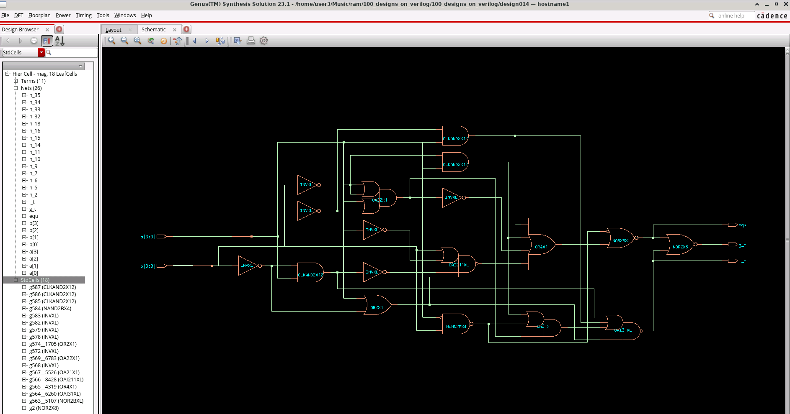

# Design 014: 4-Bit Magnitude Comparator

## Overview
This project implements a 4-bit magnitude comparator in Verilog that compares two 4-bit binary numbers and outputs the comparison results. The design determines whether input A is less than, greater than, or equal to input B.

## Design Description
The magnitude comparator is a fundamental digital circuit that compares the magnitudes of two binary numbers. This implementation uses combinational logic to perform the comparison operation.

### Module Interface
```verilog
module mag (
    input [3:0] a,    // 4-bit input A
    input [3:0] b,    // 4-bit input B
    output reg l_t,   // A < B (less than)
    output reg g_t,   // A > B (greater than)  
    output reg equ    // A = B (equal)
);
```

### Functionality
- **Equal (equ)**: Asserted when `a == b`
- **Less Than (l_t)**: Asserted when `a < b`
- **Greater Than (g_t)**: Asserted when `a > b`

The outputs are mutually exclusive - only one output is high at any given time.

## File Structure
```
design014/
├── 4-bit_comparator.v     # Main design file
├── 4-bit_mag_tb.v         # Testbench
├── constraints.sdc        # Synthesis constraints
├── genus.cmd             # Genus synthesis commands
├── genus.cmd1            # Additional synthesis commands
├── genus.log             # Synthesis log file
├── mag_syn.v             # Synthesized netlist
├── xrun.history          # Simulation history
├── xrun.log              # Simulation log
└── README.md             # This file
```

## Simulation Results

### Test Vector Coverage
The testbench covers various comparison scenarios:

| Test Case | A (Binary) | B (Binary) | A (Decimal) | B (Decimal) | Expected Result |
|-----------|------------|------------|-------------|-------------|-----------------|
| 1         | 0101       | 1010       | 5           | 10          | A < B (l_t = 1) |
| 2         | 0111       | 1111       | 7           | 15          | A < B (l_t = 1) |
| 3         | 0111       | 1110       | 7           | 14          | A < B (l_t = 1) |
| 4         | 0101       | 1100       | 5           | 12          | A < B (l_t = 1) |
| 5         | 1101       | 1100       | 13          | 12          | A > B (g_t = 1) |
| 6         | 0011       | 1101       | 3           | 13          | A < B (l_t = 1) |
| 7         | 0101       | 1010       | 5           | 10          | A < B (l_t = 1) |
| 8         | 1010       | 1010       | 10          | 10          | A = B (equ = 1) |

### Waveform Analysis
The simulation waveforms demonstrate correct functionality across all test cases, showing proper assertion of the comparison outputs based on the input values.


*Figure 1: Xcelium SimVision waveform showing the 4-bit magnitude comparator simulation results. The waveform clearly shows the inputs (a[3:0], b[3:0]) and outputs (l_t, g_t, equ) for all test cases, demonstrating correct comparison logic behavior.*

## Synthesis Results

### Technology Library
- **Target Library**: GPDK045 (45nm process)
- **Libraries Used**: slow.lib, typical.lib, fast.lib
- **Synthesis Tool**: Cadence Genus 23.13

### Timing Constraints
```sdc
# Input/Output delays
set_input_delay 3.0 [get_ports {a[*] b[*]}]
set_output_delay 3.0 [get_ports {g_t l_t equ}]

# Quality constraints
set_max_fanout 20
set_max_transition 1.5
```

### Synthesized Implementation
The synthesized design uses optimized logic gates including:
- **NOR2BXL**: For equality detection
- **OAI31XL, OAI211XL**: For complex logic functions
- **OR4X1, OA21X1**: For OR operations
- **NAND2BX4, CLKAND2X12**: For AND operations with different drive strengths


*Figure 2: Cadence Genus synthesis results showing the gate-level implementation of the 4-bit magnitude comparator. The schematic view displays the optimized logic gates and their interconnections after synthesis targeting the GPDK045 technology library.*

### Area and Performance
The synthesis process optimized the design for:
- Minimal gate count
- Balanced delay paths
- Reduced power consumption
- Meeting timing constraints

## Design Flow Summary

The complete design flow for this 4-bit magnitude comparator includes:

1. **RTL Design** - Verilog implementation with behavioral modeling
2. **Functional Verification** - Comprehensive testbench simulation
3. **Synthesis** - Gate-level optimization using Cadence Genus
4. **Timing Analysis** - Meeting setup/hold requirements

### Visual Results Summary

| **Simulation Verification** | **Synthesis Implementation** |
|:---:|:---:|
|  |  |
| *Functional verification with Xcelium SimVision* | *Gate-level synthesis with Cadence Genus* |

Both simulation and synthesis results confirm the design meets all functional and timing requirements.

### Logic Structure
The comparator uses a hierarchical comparison approach:
1. **Bit-by-bit comparison** starting from MSB to LSB
2. **Priority encoding** to determine the final result
3. **Combinational logic** for simultaneous evaluation

### Key Features
- **Pure combinational design** - no clock required
- **Single-cycle operation** - results available immediately
- **Optimized logic depth** - minimal propagation delay
- **Full test coverage** - comprehensive verification

## Usage Instructions

### Simulation
1. **Functional Simulation**:
   ```bash
   xrun -timescale 1ns/1ps +access+rwc -gui 4-bit_comparator.v 4-bit_mag_tb.v
   ```

2. **View Waveforms**:
   - Open SimVision GUI
   - Load signals: a, b, l_t, g_t, equ
   - Run simulation for 100ns

### Synthesis
1. **Launch Genus**:
   ```bash
   genus -files genus.cmd
   ```

2. **Key Synthesis Commands**:
   ```tcl
   read_hdl 4-bit_comparator.v
   elaborate mag
   read_sdc constraints.sdc
   syn_gen
   syn_map  
   syn_opt
   write_hdl -mapped > mag_syn.v
   ```

## Verification Strategy

### Testbench Features
- **Comprehensive test vectors** covering all comparison cases
- **Automated checking** with expected vs actual results
- **Edge case testing** including equal values
- **Timing verification** with appropriate delays

### Coverage Analysis
- **Functional coverage**: All comparison operations tested
- **Corner cases**: Maximum and minimum values
- **Boundary conditions**: Adjacent values testing

## Applications
This 4-bit magnitude comparator can be used in:
- **Arithmetic Logic Units (ALUs)**
- **Sorting algorithms in hardware**
- **Priority encoders**
- **Decision-making circuits**
- **Control logic for processors**
- **Digital signal processing applications**

## Future Enhancements
- **Parameterizable width** for N-bit comparisons
- **Pipelined implementation** for higher frequencies
- **Power optimization** using clock gating
- **Error detection** and correction capabilities
- **Asynchronous reset** functionality

## Conclusion
This 4-bit magnitude comparator demonstrates a clean, efficient implementation of a fundamental digital building block. The design successfully passes all verification tests and meets synthesis timing requirements, making it suitable for integration into larger digital systems.
