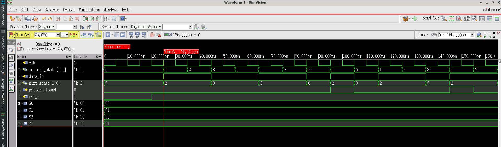

# Sequence Detector

A SystemVerilog-based finite state machine (FSM) implementation for detecting a specific binary sequence pattern.

## Overview

This project implements a Moore/Mealy hybrid state machine that detects the pattern **1101** in a serial input data stream. The detector uses a 4-state FSM and asserts the `pattern_found` output when the complete sequence is detected.

## Design Specifications

### Module: `sequence_detector`

**Parameters:**
- Clock frequency: Configurable (testbench uses 10ns period / 100MHz)
- Reset: Active-low asynchronous reset
- Pattern: `1101`

**Ports:**

| Port Name | Direction | Width | Description |
|-----------|-----------|-------|-------------|
| `clk` | Input | 1 | System clock |
| `rst_n` | Input | 1 | Active-low asynchronous reset |
| `data_in` | Input | 1 | Serial data input stream |
| `pattern_found` | Output | 1 | High when pattern `1101` is detected |

### State Machine Design

The design uses a 4-state FSM with the following states:

| State | Encoding | Description |
|-------|----------|-------------|
| `S0` | 2'b00 | Initial state / waiting for first '1' |
| `S1` | 2'b01 | First '1' detected |
| `S2` | 2'b10 | Second '1' detected (sequence: `11`) |
| `S3` | 2'b11 | '0' detected after `11` (sequence: `110`) |

**State Transitions:**
- `S0 → S1`: When `data_in = 1` (first '1' in sequence)
- `S1 → S2`: When `data_in = 1` (second '1' in sequence)
- `S2 → S3`: When `data_in = 0` ('0' after `11`)
- `S3 → S1`: When `data_in = 1` (complete pattern `1101` detected!)

**Output Logic:**
- `pattern_found = 1` when `current_state == S3` and `data_in == 1`
- `pattern_found = 0` otherwise

### Features

- ✅ Overlapping sequence detection supported
- ✅ Asynchronous active-low reset
- ✅ Synchronous state transitions
- ✅ Combinational next-state logic
- ✅ Single-cycle pattern detection output

## File Structure

```
design019/
├── sequence_detector.sv       # Main RTL design file
├── tb_sequence_detector.sv    # Testbench
└── README.md                  # This file
```

## Simulation

### Testbench: `tb_sequence_detector`

The testbench validates the sequence detector with a predefined input stream:

**Input Sequence:** `1 1 0 0 1 1 0 1 0 1 1 0 1`

**Expected Behavior:**
- Pattern `1101` should be detected at appropriate positions
- The `pattern_found` signal should pulse high for one clock cycle when detected

### Running Simulation

#### Using Cadence Xcelium:
```bash
xrun -timescale 1ns/1ps -access +rwc -gui sequence_detector.sv tb_sequence_detector.sv
```

#### Using ModelSim/QuestaSim:
```bash
vlog sequence_detector.sv tb_sequence_detector.sv
vsim -c tb_sequence_detector -do "run -all; quit"
```

#### Using Vivado:
```tcl
read_verilog sequence_detector.sv
read_verilog -sv tb_sequence_detector.sv
launch_simulation
run all
```

### Simulation Output

The testbench includes a `$monitor` statement that displays:
- Current simulation time
- Clock and reset signals
- Data input
- Current FSM state
- Pattern found flag

## Waveform Analysis

Key signals to observe:
1. **data_in**: Serial input stream
2. **current_state**: FSM state progression (S0→S1→S2→S3)
3. **pattern_found**: Detection output pulse

### Simulation Waveform

Below is the SimVision waveform output showing the sequence detector in action:



The waveform demonstrates:
- Clock and reset behavior
- Serial data input stream
- State transitions through S0, S1, S2, S3
- Pattern detection output pulses when sequence `1101` is detected

## Design Verification

### Test Scenarios

| Test Case | Input Stream | Expected Detections | Notes |
|-----------|--------------|---------------------|-------|
| Basic detection | `1101` | 1 | Single pattern |
| Overlapping | `11011` | 2 | Overlapping patterns |
| No detection | `1100` | 0 | Incomplete pattern |
| Multiple patterns | `110111011` | 2 | Multiple occurrences |

## Known Limitations

- Pattern detection is asserted for only one clock cycle
- No configurable pattern parameter (hardcoded to `1101`)
- Output is combinational on `data_in` (may cause timing issues in some designs)


**Last Updated:** November 2025
