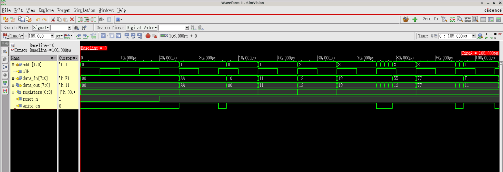

# Register Bank

A simple synchronous register bank with configurable width and depth.

## Design Parameters

- **WIDTH**: 8 bits (data width)
- **DEPTH**: 4 registers
- **Address**: 2 bits (to address 4 locations)

## Module Interface

```systemverilog
register_bank #(WIDTH, DEPTH) (
    input  clk,
    input  reset_n,
    input  [1:0] addr,
    input  write_en,
    input  [7:0] data_in,
    output [7:0] data_out
);
```

## Operation

- **Write**: On `posedge clk` with `write_en=1`, `data_in` is stored at `addr`
- **Read**: Combinational output - `data_out` reflects the value at current `addr`
- **Reset**: Active-low asynchronous reset clears all registers to 0

## Waveform Observations

### TEST 1: Simple Write/Read
- Write `0xAA` to address 1
- Read back shows `0xAA` at address 1

### TEST 2: Fill All Registers
- Sequential writes to all 4 locations (values: `0x10, 0x11, 0x12, 0x13`)
- Sequential reads confirm stored values

### TEST 3: Back-to-Back Writes
- Consecutive clock cycle writes to addresses 2 (`0x55`) and 3 (`0x77`)
- Both values successfully stored and read back

### TEST 4: Read-During-Write
- Write `0xF1` to address 1 while reading same address
- Output shows new value after clock edge (write-first behavior)

## Key Characteristics

- **Synchronous writes**: Data captured on rising clock edge
- **Asynchronous reads**: Output updates combinationally with address changes
- **Read-during-write**: New data visible on same address after write completes

## Simulation Waveform


