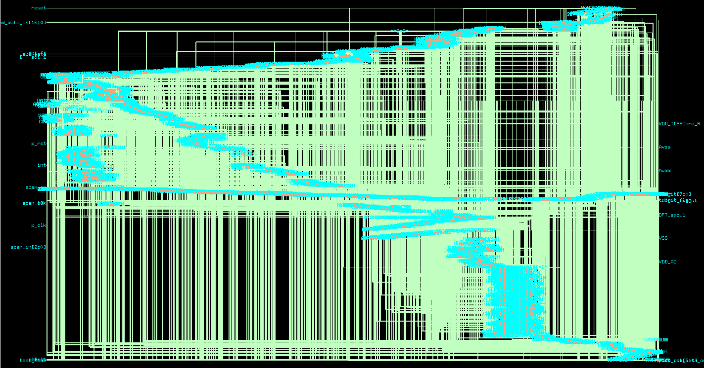

# DFT Scan Synthesis for DTMF Receiver Core

## Project Overview
This repository documents the Design for Testability (DFT) implementation and scan synthesis for the `dtmf_recvr_core` module[cite: 1]. The synthesis was performed using Cadence Genus Synthesis Solution version 23.13-s073_1[cite: 1]. The design was mapped and optimized for the `ss_1v08_125c` operating conditions using a physical library area mode[cite: 1, 2].

## DFT Architecture & Scan Configuration
The design successfully passed all pre-insertion DFT rule checks and was configured with the following test architecture[cite: 3]:

*   **Scan Style**: The architecture utilizes a `muxed_scan` style[cite: 3].
*   **Total Scan Chains**: The standard sequential elements were divided into 2 discrete scan chains[cite: 3].
*   **Chain 1 (`chain1`)**: A custom-defined chain containing 129 flip-flops that trigger on the falling edge of the test clock[cite: 3].
*   **Chain 2 (`AutoChain_1`)**: An auto-generated chain containing 499 flip-flops that trigger on the rising edge of the test clock[cite: 3].
*   **Test Signals**: The shift enable signal is mapped to `scan_en` (active high), and the test mode signal is mapped to `test_mode` (active high)[cite: 3].
*   **Test Clock**: A dedicated test clock named `scan_clk` was defined with a period of 50000.0[cite: 3].
*   **Clock Bypass**: To ensure controllability during test mode, the `refclk` pin on the `PLLCLK_INST` macro is bypassed directly to `clk1x`[cite: 3].

## Quality of Results (QoR)
Following the insertion of the scan multiplexers and subsequent incremental optimization, the design achieved the following metrics:

### Area & Gate Count
*   **Total Cell Area**: 215,888.755[cite: 1, 2].
*   **Total Net Area**: 29,893.965[cite: 1, 2].
*   **Total Area (Cell + Net)**: 245,782.720[cite: 1, 2].
*   **Total Leaf Instances**: 4,874[cite: 1, 2].
*   **Sequential Instances**: 631[cite: 2].
*   **Combinational Instances**: 4,243[cite: 2].

### Technology Libraries Utilized
*   Standard Cells: `ss_g_1v08_125c 1.1` and `ss_hvt_1v08_125c 1.1`[cite: 2].
*   Memory Macros: `ram_256x16_slow 1.1` and `rom_512x16A_slow 1.1`[cite: 2].
*   Clocking Macros: `pllclk 4.3`[cite: 2].
*   Physical Layout: `physical_cells`[cite: 2].

## Timing Closure
The scan insertion was successfully optimized without introducing any timing violations across the design.

*   **Total Negative Slack (TNS)**: 0.0[cite: 2].
*   **Violating Paths**: 0[cite: 2].
*   **Critical Path Domain**: The most constrained clock domain is `m_clk` (period: 8000.0), which achieved a Worst Negative Slack (WNS) of 0.1[cite: 2].
*   **Path Verification**: The setup timing check for the critical path ending at the `TDSP_CORE_INST_EXECUTE_INST_p_reg[30]/D` pin was MET with exactly 0 slack[cite: 4].
*   **Data Path Delay**: The total data path delay for this specific critical path was measured at 7640 ps[cite: 4].
