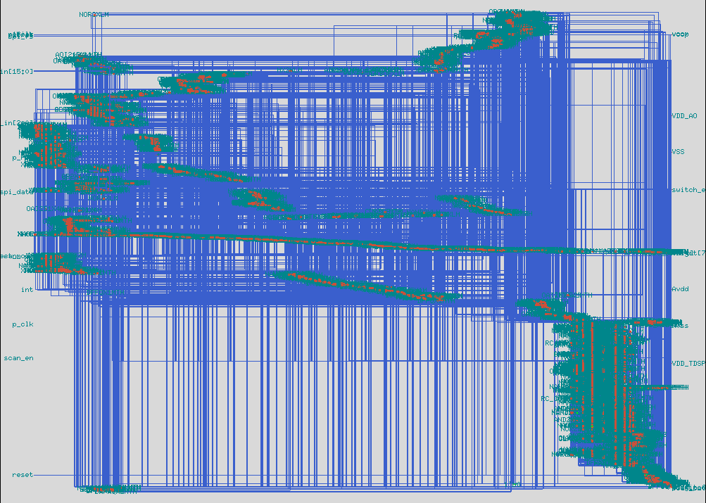

# Low-Power Synthesis — dtmf_recvr_core (report-driven summary)

This document summarizes the low-power synthesis results for `dtmf_recvr_core` produced by Cadence Genus and the accompanying report artifacts in the `reports/` folder. The rewrite emphasizes concrete findings from the generated reports (`gates_lp.rpt`, `power_lp.rpt`, `clock_gates_lp.rpt`, `qor.rpt`) and provides short recommendations.

## Build & Flow Context

- Tool: Cadence Genus Synthesis Solution 23.13-s073_1
- Operating condition: `ss_1v08_125c` (1.08 V, 125°C) as used for synthesis and characterization
- Technology & libraries: `ss_g_1v08_125c`, `ss_hvt_1v08_125c`, `ram_256x16_slow`, `rom_512x16A_slow`, `pllclk`, `physical_cells`
- Area mode: physical library; interconnect mode: global
- Genus runtime: ~1058 s (elapsed wall: 4549 s); peak memory reported: 2417.58

## Design snapshot (from reports)

- Top module: `dtmf_recvr_core`
- Total leaf instances: 4408 (sequential: 548, combinational: 3860)
- Cell area (cell-only): 205,123.127 units; net area: 24,431.609; total area (cells + net): 229,554.736
- Primary clocks seen in timing report: `m_clk`, `m_digit_clk`, `m_dsram_clk`, `m_ram_clk`, `m_rcc_clk`, `m_spi_clk`, `refclk` (periods reported in the QoR file)

## Power summary (from `power_lp.rpt` and `qor.rpt`)

- Total (reported): 0.003 W (3 mW) dynamic; leakage reported as 0.000 W in the summary (see notes below)
- Breakdown by category (percentage of total reported power):
	- `bbox` (power attributed to bounding box / timing models / memory macros): ~68.6% of reported power
	- `logic`: ~22.8%
	- `register` (sequential elements): ~6.3%
	- `clock` power: ~2.4%

- Library contribution (power & instance share):
	- `rom_512x16A_slow` shows ~80.9% of the internal power contribution (0.002 W internal power), indicating the ROM macro dominates internal switching power in the current scenario.
	- Two DRAM/BRAM macros (`ram_256x16_slow`) and the PLL block have significant area but low reported dynamic power in the frame used.

Notes: the `power_lp.rpt` output uses a single PDB frame (`/stim#0/frame#0`) and reports power in Watts. Macro timing models and memory macros can dominate internal power numbers depending on stimulus and the `.tcf` switching activity used for estimation.

## Clock gating (from `clock_gates_lp.rpt`)

- Total clock sinks: 514 (559 bits); total clock gates inserted by synthesis: 34
- Sinks gated by synthesis clock gates: 448 sinks (87.16% of sinks; 80.14% of bits)
- Ungated sinks: 66 (12.84%) — these should be inspected to confirm they are intentionally ungated (test pins, asynchronous control, scan, spare registers, or excluded via `lp_clock_gating_exclude`).

## Gate / Library usage (from `gates_lp.rpt`)

- Total instances: 4408
- HVT (`ss_hvt_1v08_125c`) vs standard-gate usage: report shows ~50.7% of instances mapped to HVT cells, indicating the synthesis used multi-Vt swapping to favor high-Vt cells where timing slack allowed.

## Timing & QoR highlights (from `qor.rpt`)

- No timing groups show failing paths in the QoR summary (TNS reported as 0.0 for groups listed)
- Clock `m_clk` appears in the timing cost table; periods for clocks are present (e.g., `m_clk` = 8000.0 in the QoR file — use consistent units when reporting the period locally)

## Short assessment and interpretation

- Power: the design reports a low dynamic power figure (≈3 mW) for the frame used, however the ROM timing model accounts for most of the internal power reported (∼80%). Verify the switching stimulus (`.tcf` / VCD/TGF) used for power measurements matches expected on-chip activity; macro models can skew totals if the test frame activates memory-heavy behavior.
- Clock gating: synthesis inserted 34 CGs and gated ~87% of sinks — this is a strong result. Investigate the remaining ungated sinks for missed gating opportunities or legitimate exclusions (scan, asynchronous controls, test logic).
- Multi-Vt: ~50.7% HVT mapping indicates a sensible leakage optimization strategy where timing slack allowed replacing standard cells with HVT. Confirm timing margin at the block boundaries and I/O paths before more aggressive HVT conversion.
- Area: a large portion of reported cell area is consumed by macros (PLL, RAM, ROM). If the target is system-level power/energy, consider architectural changes or macro low-power modes.

## Recommendations / Next actions

- Validate the power stimulus: ensure `.tcf`/SAIF/VCD frames reflect representative operational modes (standby, active, paging) to get realistic power breakdowns.
- Inspect the 66 ungated sinks: run `report_clock_gating -detail` (or inspect `clock_gates_lp.rpt` entries) and classify each as gated-excluded (test/scan), intentionally ungated, or missed opportunity.
- For ROM-dominated internal power: consider placing ROM in a lower switching activity scenario during synthesis power analysis, or explore ROM retention/clock gating if supported by macro.
- If leakage targets must be tightened further, incrementally increase HVT conversion but re-run timing/regression on top-level interfaces to avoid margin loss.
- For additional dynamic power reduction: consider operand isolation around high-fanout datapath elements or fine-grained clock/clock-domain gating at higher synthesis levels.

## Where to find the artifacts

- Synthesis reports: `reports/gates_lp.rpt`, `reports/qor.rpt`, `reports/power_lp.rpt`, `reports/clock_gates_lp.rpt`
- Visual snapshot: `genus_low_power_synthesis.png`

If you want, I can (pick one):
- run a focused analysis of the 66 ungated sinks and produce a short, classified list; or
- generate a short script to extract the ROM/macro power lines and create a 1-page summary table from `power_lp.rpt`.

-- End of report-driven summary

