# Innovus GUI Notes — DTMF Receiver: Design Import & Floorplanning Basics
*`RTL_to_GDSII_projects / 3.DTMF_Receiver / placement_and_route / design_import / innovus_gui`*

Notes and screenshots from my first hands-on pass through the Cadence Innovus Implementation System GUI, working with the DTMF Receiver design. The goal here wasn't a finished floorplan — it was building fluency with the interface itself: importing a design, reading what's on screen, navigating with bindkeys, and getting comfortable with the panels I'll be using throughout placement and route.

All images below live alongside this file in `design_import/innovus_gui/`.

## Contents

- [Importing the Design](#importing-the-design)
- [Cell Viewer](#cell-viewer)
- [Display Preferences](#display-preferences)
- [Module Guides](#module-guides)
- [Design Browser](#design-browser)
- [Bindkeys in Practice](#bindkeys-in-practice)
- [Customizing the GUI](#customizing-the-gui)
- [Setting Up the Floorplan](#setting-up-the-floorplan)
- [Takeaways](#takeaways)

## Importing the Design

Brought the design into Innovus through the Design Import form: a gate-level Verilog netlist, LEF libraries (technology rules plus macro and standard-cell abstracts), an MMMC view file pointing to the timing libraries and SDC constraints, and `VDD` / `VSS` set as the power and ground nets. IO placement came in separately afterward from a DEF file, then I fit the view to the window to see the whole chip.

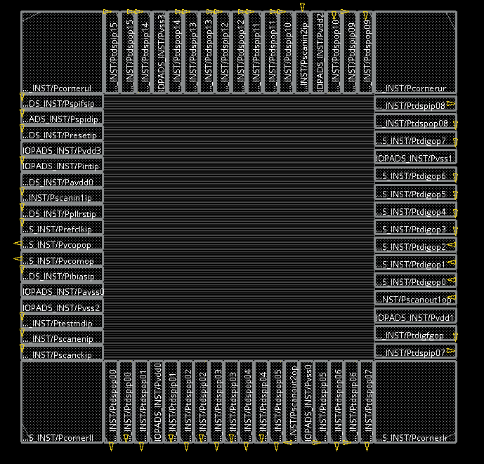
*Design Import form — netlist, LEF libraries, power/ground nets, and the MMMC view file set before reading in IO placement.*

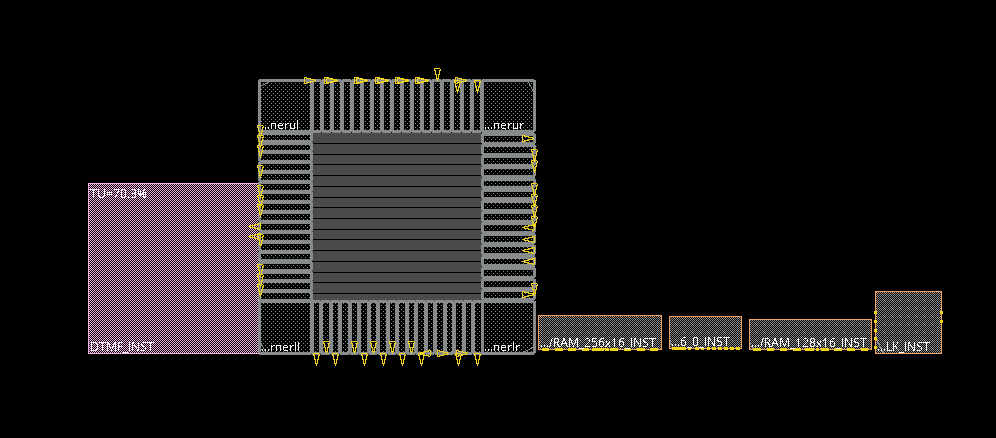
*First look at DTMF_CHIP after import — the unplaced logic (pink module guide, sized by utilization) on the left, hard macros lined up to the right of the core, IO pins ringing the block.*

Also switched on pin shape visibility for cell objects, so macro and standard-cell pins render as actual geometry instead of just bounding boxes.

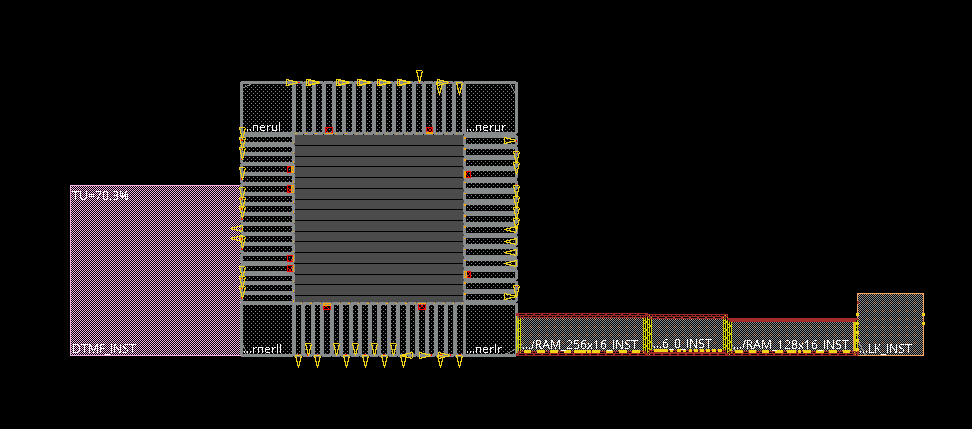
*Pin Shapes visibility turned on under the Cell category.*

## Cell Viewer

Opened the Cell Viewer (Tools → Cell Viewer) to look at the LEF abstracts behind individual standard cells — internal metal routing, pin shapes, and where the VDD/VSS rails sit inside a cell's footprint. Recorded a short walkthrough browsing a few entries in the FE Cells list.

<video src="cell_viewer_video.mp4" controls width="640"></video>

*Cell Viewer walkthrough — browsing standard-cell LEF abstracts and their pin/power layout. ([direct link](cell_viewer_video.mp4) if it doesn't play inline)*

## Display Preferences

Under **All Colors**, visibility and selectability are two independent switches per object type — useful for decluttering a busy view without losing the ability to click on things, or the opposite: keeping something visible but locked from accidental selection.

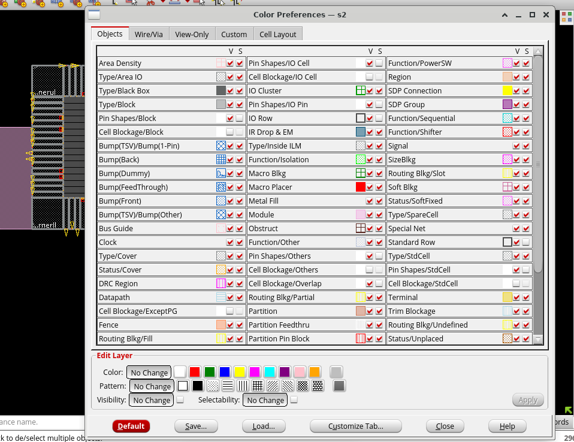
*Color Preferences — each object class gets its own V (visible) / S (selectable) toggle; tried switching terminal visibility off as a test.*

## Module Guides

The pink boxes to the left of the core are module guides — placeholders for logic that hasn't been placed yet, sized roughly by how many standard cells each module contains. Selected the top-level guide and ungrouped it once to break it into its child modules.

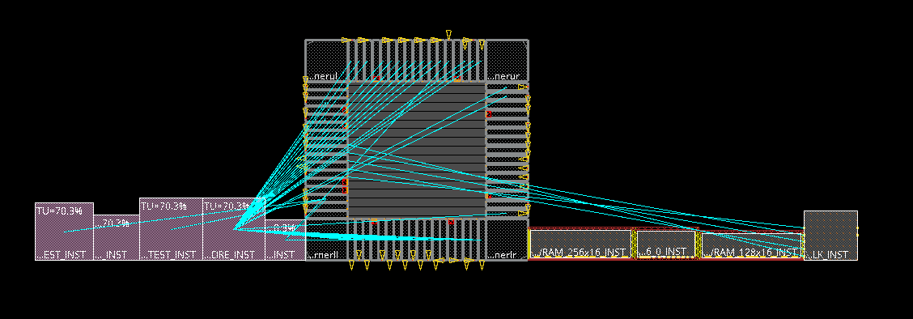
*Module guide selected — ungrouping splits it into the sub-module guides underneath it.*

There's also a threshold controlling how small a module can be before it just gets folded into a neighboring guide instead of getting its own box — set under View → Set Preference → Display as "Min. Floorplan Module Size."

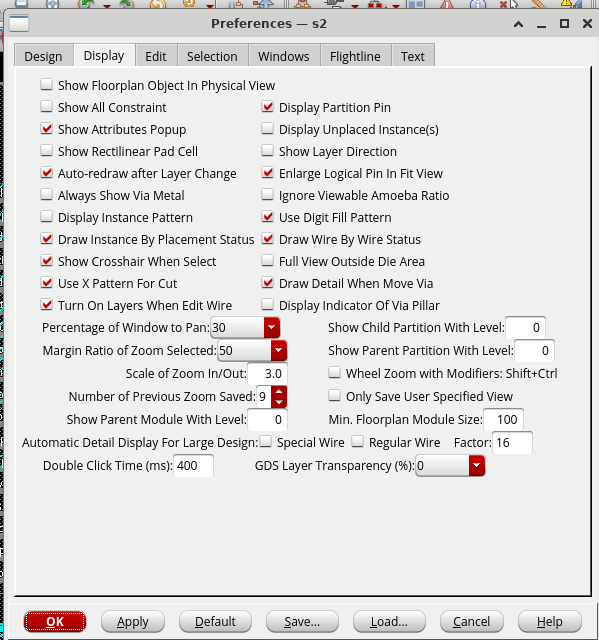
*Modules with fewer instances than this threshold get merged into another guide rather than drawn separately.*

## Design Browser

Tools → Design Browser gives a tree view of the actual logical hierarchy — ports, nets, and hierarchical instances — separate from the physical module guides on the floorplan. Drilled down from the top-level DTMF_CHIP design into its sub-blocks (the DSP core, the µ-law converter, DMA, SPI, the RAM test instances, and so on), then further into a block's ports to see its I/O list.

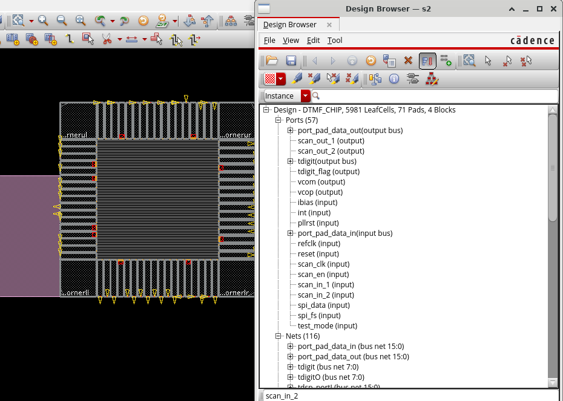
*Design Browser — hierarchy from the top-level design down through instances, nets, and ports.*

## Bindkeys in Practice

Spent time on single-key shortcuts instead of hunting through menus: `a` for select mode, the Move tool plus `r` to flip/rotate a selected instance, `Shift-G` to ungroup a module guide, `Shift-Z` and the arrow keys to zoom and pan. Dragging an object toward the core lit up its flight lines — the rat's-nest connections showing every net tying that object back to the rest of the design.

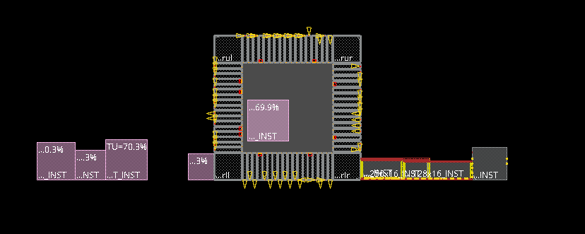
*Move/rotate bindkeys in action — dragging a macro and a module guide toward the core; blue flight lines trace connectivity back to the rest of the netlist.*

Worth noting: the floorplan itself hadn't been initialized yet at this point, so there was no real core boundary — this was purely about getting comfortable with select/move/rotate before anything counted. Also tried remapping a bindkey (Zoom In from `Z` to `J`, via the Binding Key preferences form) just to confirm shortcuts are user-editable, then set it back.

## Customizing the GUI

The interface is scriptable — used `gui_add_ui` from the command line to build a menu on the fly: a new top-level menu, a command underneath it, a new toolbar, and a toolbutton with its own icon and tooltip. Tore it all back down afterward with `gui_delete_ui`.

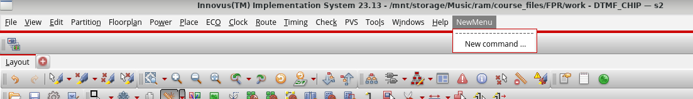
*A custom menu, command, and toolbar added with `gui_add_ui` — confirms the GUI can be extended past the default panels.*

## Setting Up the Floorplan

Cleared out everything from the bindkey experiments first — Clear Floorplan, "All Floorplan Objects" — to start from a blank slate. (The form also supports clearing just a subset, like placement blockages or preplaced macros, instead of everything at once.)

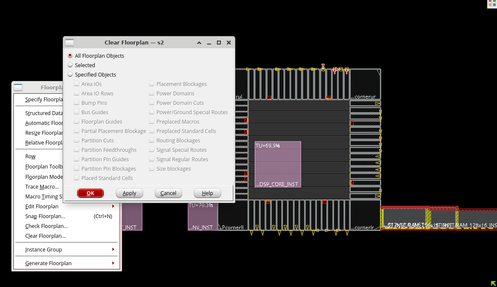
*Clear Floorplan — reset before defining the actual core/die geometry.*

Then defined the core through Specify Floorplan using aspect ratio and utilization rather than hard-coded width/height, with a uniform margin between the core and the IO boundary on all four sides.

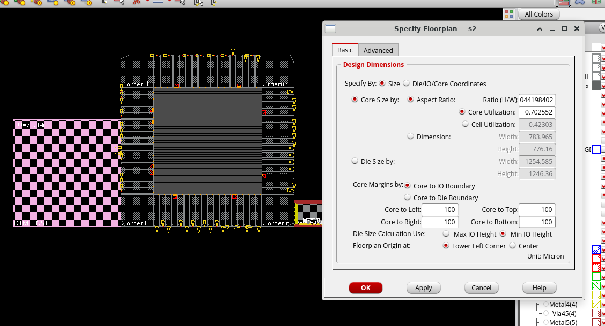
*Specify Floorplan — core sized by aspect ratio/utilization, with an equal core-to-IO margin on every side.*

With the core boundary finally in place, used the ruler (`k`) to measure the core-to-IO gap on screen as a sanity check against the margin entered above — it snaps to object edges, wires/vias, pins, and the manufacturing grid by default.

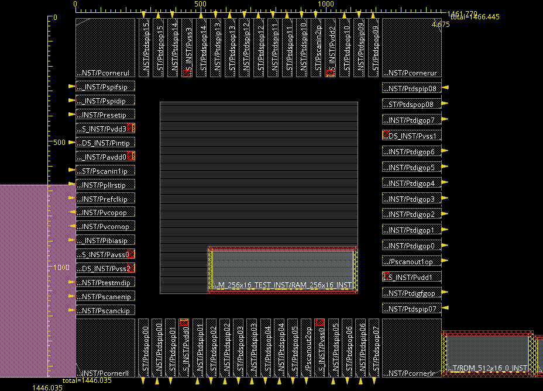
*Ruler bindkey — verifying the core-to-IO distance matches the specified margin.*

## Takeaways

- Module guides are a visual proxy for unplaced logic — size tracks utilization, not final area; group/ungroup lets you drill in or roll back up.
- Visibility and selectability are separate, per-object-type switches — good to know before a "why won't this select" moment.
- Bindkeys, including remapped ones, are noticeably faster than menu-diving for repetitive floorplan edits.
- Placement only means something once Specify Floorplan has actually run — moving objects around before that is just practice.
- The GUI is Tcl-scriptable (`gui_add_ui` / `gui_delete_ui`), which is a good sign for automating repetitive setup later.

**Next up:** power planning (rings/stripes) and deliberate macro placement, followed by standard-cell placement.
