# Floorplan & Power Planning Notes — DTMF Receiver
*`RTL_to_GDSII_projects / 3.DTMF_Receiver / placement_and_route / floorplan_and_powerplan`*

Continuing on from design import, this session covered manual floorplan edits, relative floorplanning, block halos, power rings/stripes, preplacing a single standard cell, followpin power routing, and an early static rail (IR-drop) analysis — all in Innovus, still on the DTMF Receiver design.

Two non-image files live alongside the screenshots: `dtmf.setup` (the environment script sourced at the start of each session — reads in the libraries and I/O placement) and `test_floorplan_relative.fp` (a saved checkpoint of the relative-floorplan constraints from that exercise).

## Contents
- [Floorplan Blockages](#floorplan-blockages)
- [Relative Floorplanning](#relative-floorplanning)
- [Loading a Floorplan Checkpoint](#loading-a-floorplan-checkpoint)
- [Power Rings](#power-rings)
- [Power Stripes](#power-stripes)
- [Preplacing a Standard Cell](#preplacing-a-standard-cell)
- [Followpin Routing](#followpin-routing)
- [Rail Analysis](#rail-analysis)
- [Takeaways](#takeaways)

## Floorplan Blockages

Practiced the two blockage types directly on the floorplan canvas: a routing blockage, which keeps specific metal layers clear of a region to relieve congestion, and a placement blockage, which keeps standard cells out of an area entirely (or, set to "Partial" with a density value, just thins them out instead of excluding them completely).

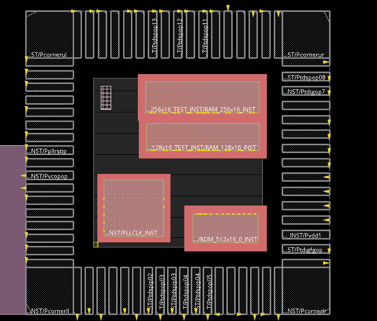
*Routing and placement blockages — drawn the same way, by dragging a box on the canvas, but affecting different stages of implementation.*

## Relative Floorplanning

Instead of fixed coordinates, used `create_relative_floorplan` to position blocks in terms of separation from a reference — first pinning `ROM_512x16_0_INST` a fixed offset from the core boundary, then pinning `PLLCLK_INST` a fixed offset from that ROM instance rather than from the core:

```tcl
create_relative_floorplan -place DTMF_INST/ARB_INST/ROM_512x16_0_INST -ref_type core_boundary ...
create_relative_floorplan -place DTMF_INST/PLLCLK_INST -ref_type object -ref DTMF_INST/ARB_INST/ROM_512x16_0_INST ...
```

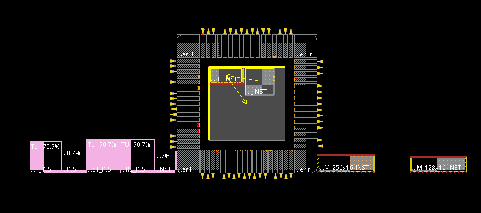
*Two chained relative constraints — the ROM pinned to the core boundary, the PLL pinned to the ROM.*

Then deleted just the ROM's constraint (`delete_relative_floorplan DTMF_INST/ARB_INST/ROM_512x16_0_INST`) and moved the ROM to a new spot — the PLL followed it anyway, since its own constraint pointed at the ROM object, not the core, and was never touched.

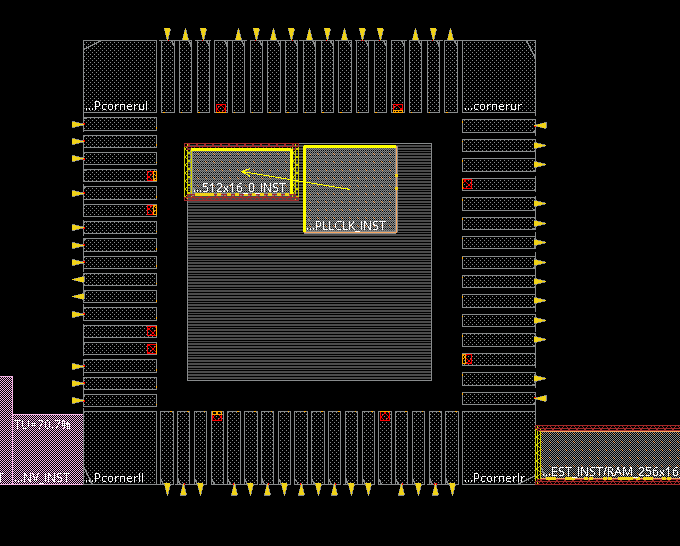
*Constraint chain intact — removing the ROM's link to the core boundary left the separate PLL-to-ROM constraint untouched.*

## Loading a Floorplan Checkpoint

Reloaded a saved floorplan (`dtmf_blocks.fp`) partway through to bring the macros back to a known placed state — a reminder that floorplans checkpoint and reload cleanly through File → Load → Floorplan instead of needing to be rebuilt by hand each time.

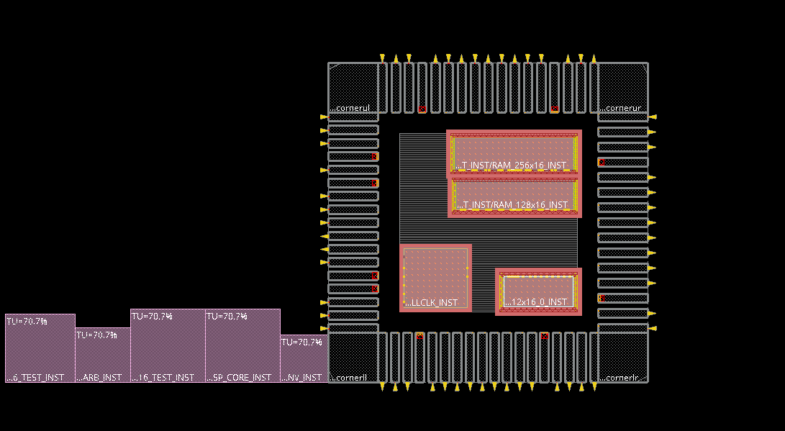
*Reloading a saved `.fp` checkpoint to restore macro placement.*

From there, added a keep-out halo around the PLL block (`create_place_halo`, 30 units on all four sides) — a placement-blockage ring that keeps neighboring cells and macros from crowding right up against it — and confirmed its size afterward with the ruler.

## Power Rings

Set up the power nets first — picked `VDD` and `VSS` out of the design's net list and moved them into the "chosen" side of the Add Ring form.

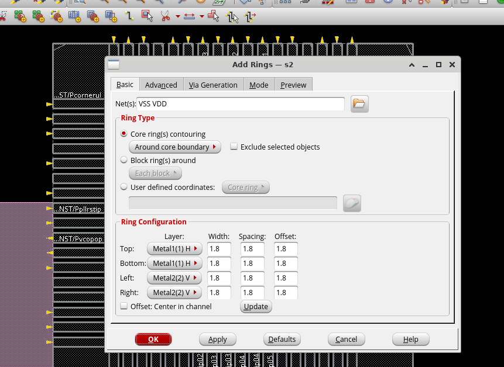
*Selecting VDD/VSS as the nets to ring before generating anything.*

Ran a core ring around the die boundary — Metal5 horizontal on top/bottom, Metal6 vertical on left/right, 8-unit width with 1-unit spacing — and both RAMs and the ROM picked up a ring automatically since they sit against the boundary. The PLL, fully inside the core, didn't.

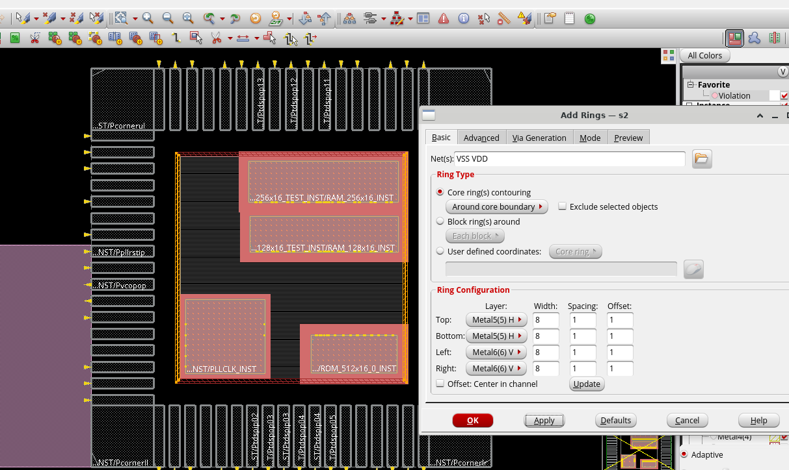
*Core rings appear on macros that touch the core boundary; the PLL — sitting inboard — is still bare here.*

So the PLL got a block-level ring of its own, configured to line up with the core ring's segments rather than floating independently.

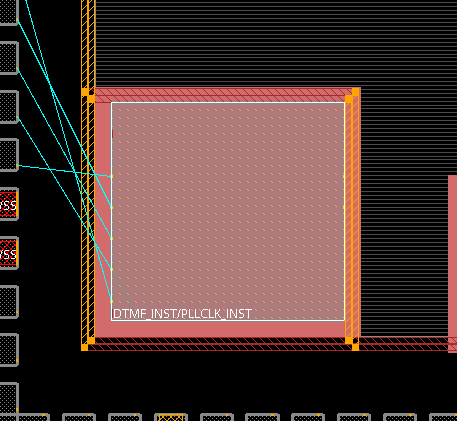
*A block ring added specifically around the PLL, since it doesn't sit on the core boundary.*

## Power Stripes

Added vertical Metal6 stripes (same 8-unit width, 1-unit spacing, spaced 100 units apart, starting/stopping 100 units in from the core edge) to carry VDD/VSS from the rings into the interior — vias landed automatically wherever a stripe crosses a ring.

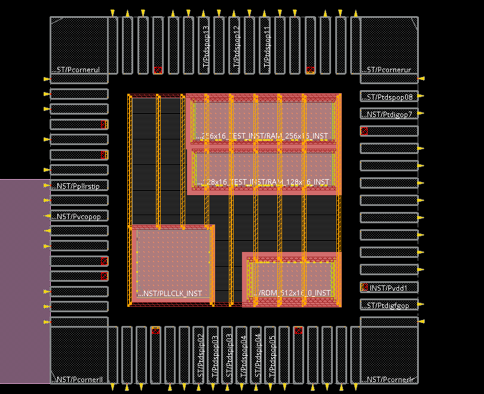
*Stripes plus auto-generated vias tying the ring structure into the middle of the core.*

That's roughly where the power-planning pass wrapped up — rings, the PLL's block ring, the halo, blockages, and stripes all sitting together.

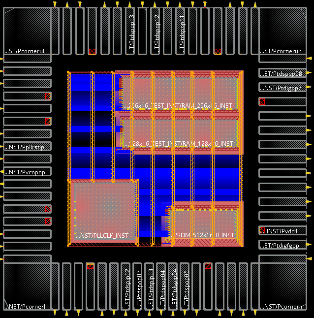
*The floorplan at the end of the power-planning exercise, before moving on to cell-level connections.*

## Preplacing a Standard Cell

Used the Design Browser's search to jump straight to one flip-flop — `DTMF_INST/DIGIT_REG_INST/digit_out_reg_3`, an `SDFFSHQX1` — opened its Object Attributes, and hand-edited the `location` field to `700 700`. Switching to Physical View (with StdCell visibility on) showed that single cell sitting exactly where it was pinned, between a pair of the VDD/VSS stripes.

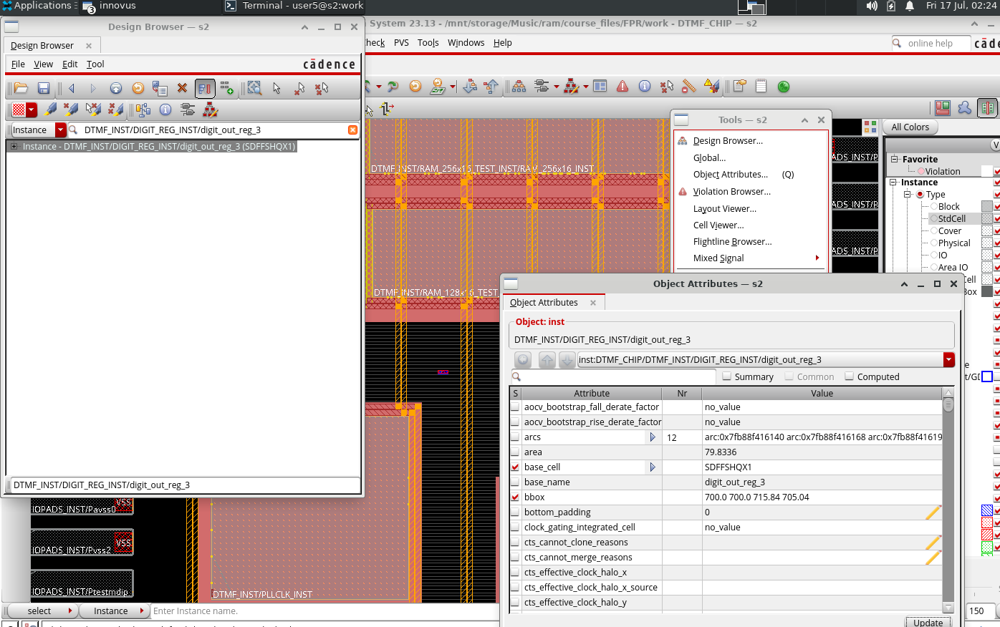
*Hand-placing a single standard cell by editing its `location` attribute directly — no floorplan-toolbar interaction needed.*

## Followpin Routing

Before routing power to the standard-cell rows, tied the global `VDD`/`VSS` net names to every cell's power pins (`connect_global_net`). Then set up Special Route for followpin routing only — everything unchecked except **Follow Pins**, Metal6 as the top layer and Metal1 as the bottom, jogging and layer changes both allowed, and via generation targeting the stripes.

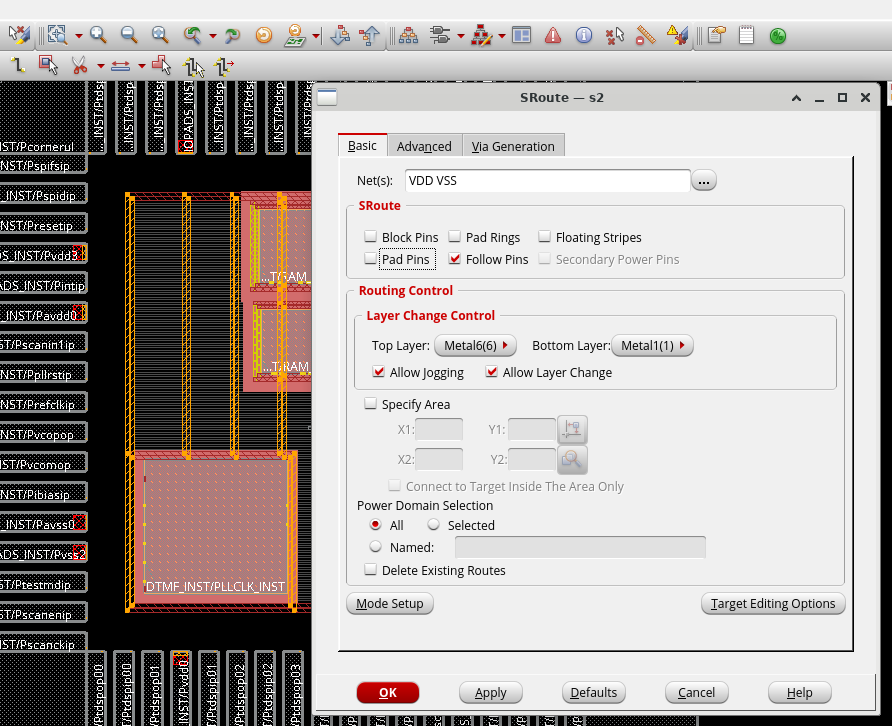
*Special Route set to followpin mode — this is what lays down the per-row VDD/VSS rails.*

Every standard-cell row picked up its own rail, tied back into the stripes and rings above through vias generated at each crossing.

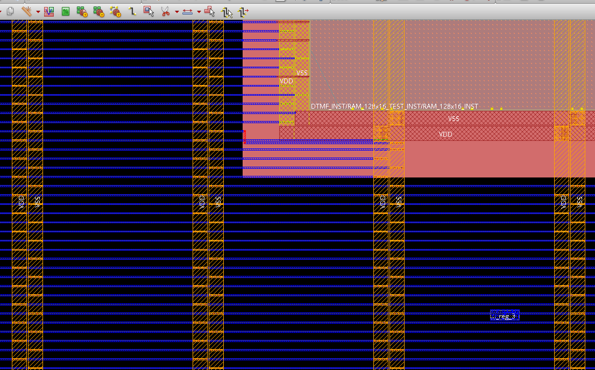
*Per-row VDD/VSS rails, connected into the rest of the power grid.*

## Rail Analysis

Sourced `power.tcl` for the global net rules, then set up rail analysis: early-stage, static, XD accuracy, run against the design's default analysis view, pointed at the process's QRC extraction tech file with a 50 µm source search distance.

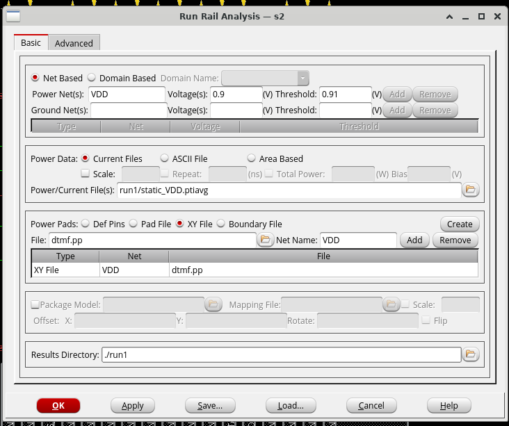
*Rail analysis configured as an early-stage static run, using the QRC extraction tech file for the process.*

Built the power-source list for the run by auto-fetching the actual VDD pad locations off the design — several source points spread across metal layers M1 through M4 — and saved that out as an XY file for the analysis to read.

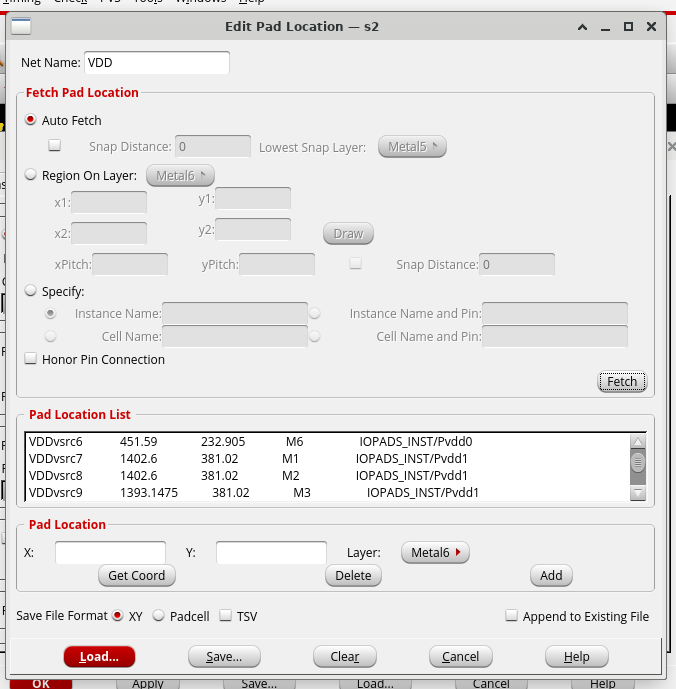
*Auto-fetched power-source pad locations for the VDD net, saved as an XY file.*

Ran it at 0.9 V nominal with a 0.81 V threshold and switched the Power Rail Plot over to IR Drop, which color-codes the whole design from blue (minimal drop) to red (significant drop) — a quick visual read on where the grid might be under-resourced.

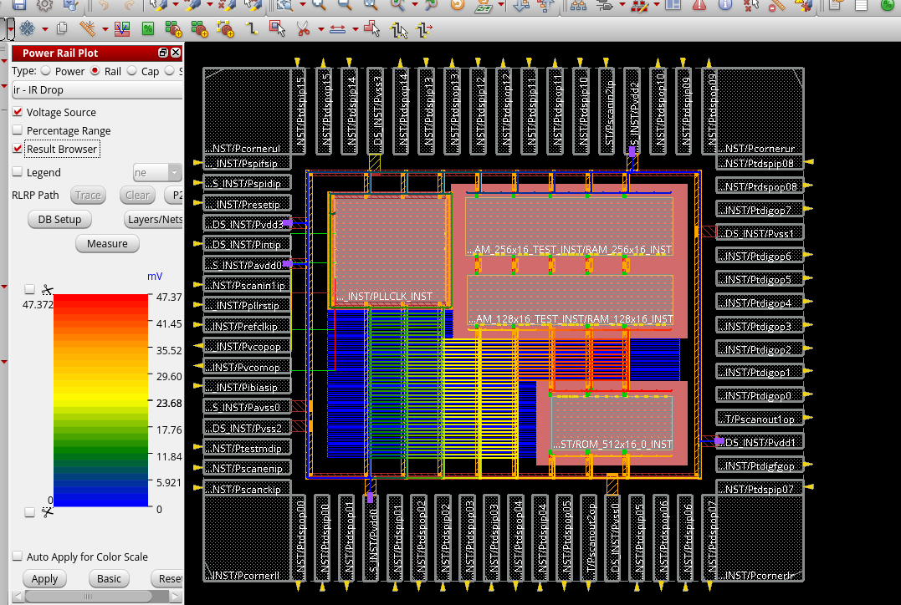
*IR-drop heatmap from the early rail analysis run.*

## Takeaways

- Relative floorplan constraints are directional and object-scoped — deleting a block's link to the core doesn't touch a *different* block's link to that block.
- A macro sitting fully inside the core boundary won't inherit a core ring automatically; it needs its own block ring, aligned to the core ring's segments.
- The power grid builds up in layers, each with its own form: core/block rings → stripes → followpin (per-row) rails — every layer needs vias explicitly generated down to the one below it.
- The Design Browser can preplace any single instance by editing its `location` attribute directly, without touching the floorplan toolbar at all.
- Rail analysis takes its own inputs — an extraction tech file and actual power-source pad locations — separate from the design's timing/power libraries; it isn't derived automatically from the floorplan.

**Next up:** full standard-cell placement and clock tree synthesis, then a sign-off-accuracy rail analysis once placement settles.
