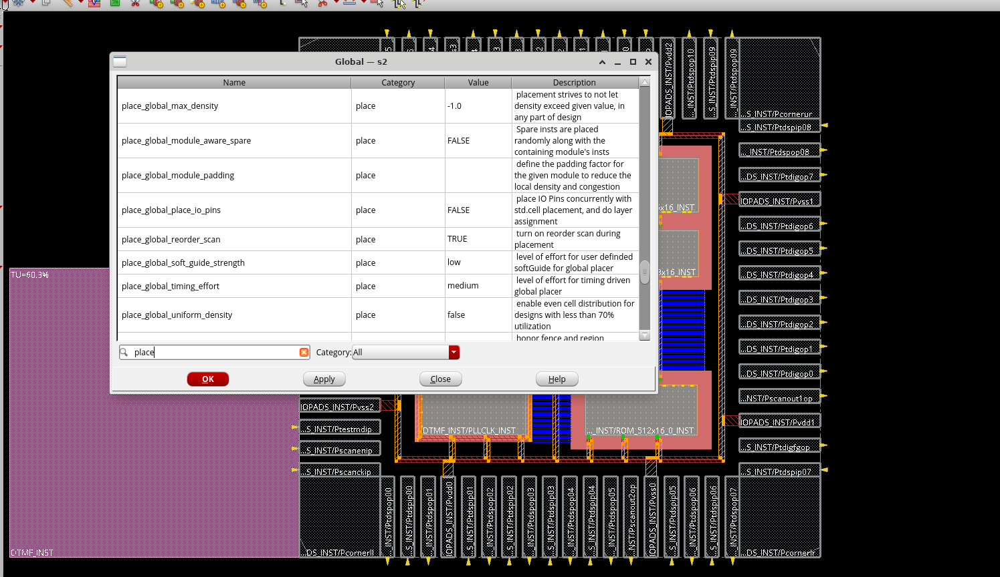
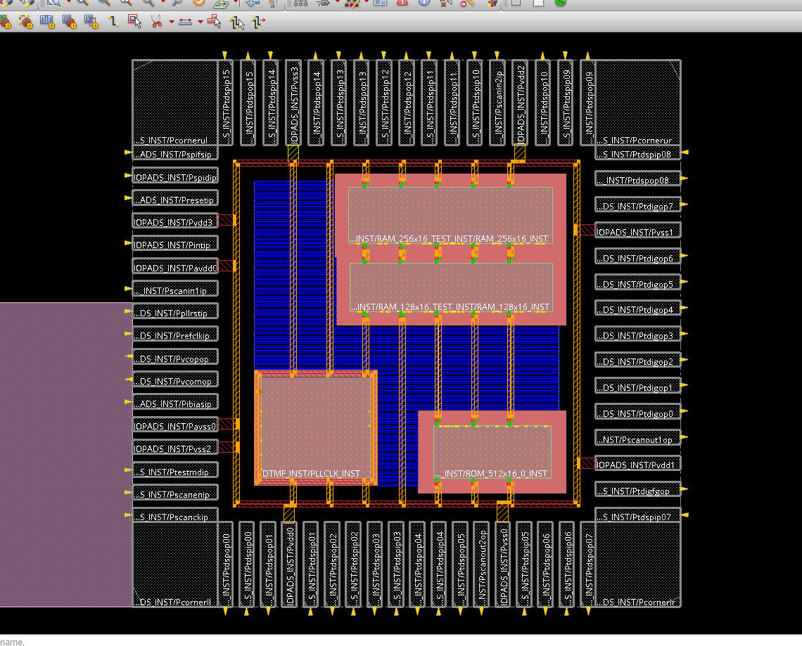
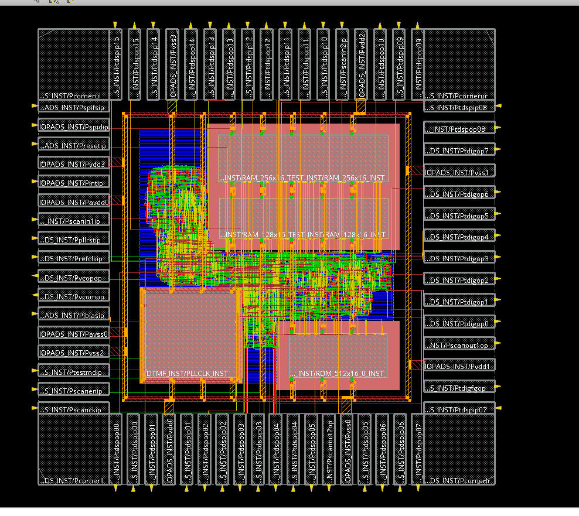
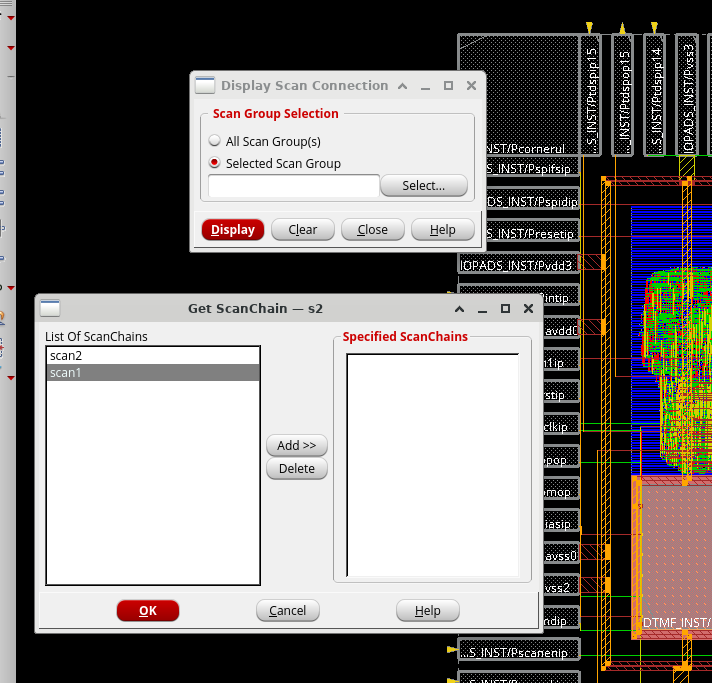
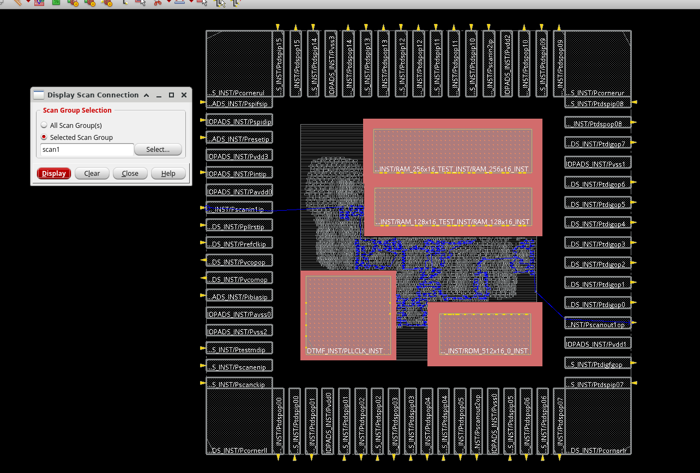
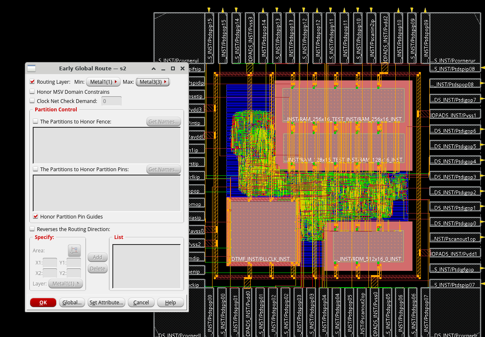
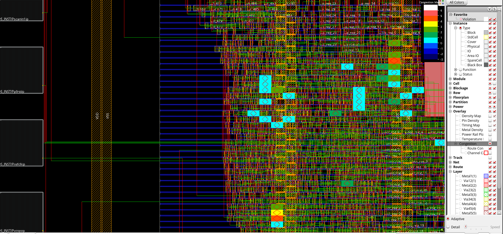
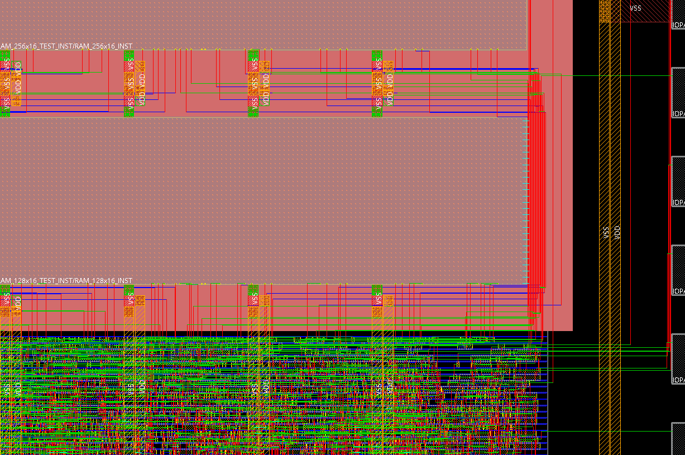
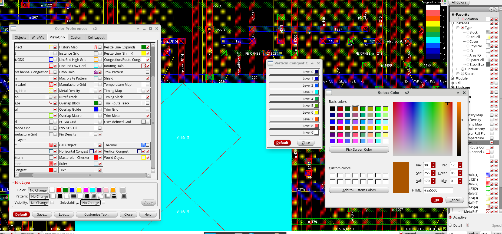
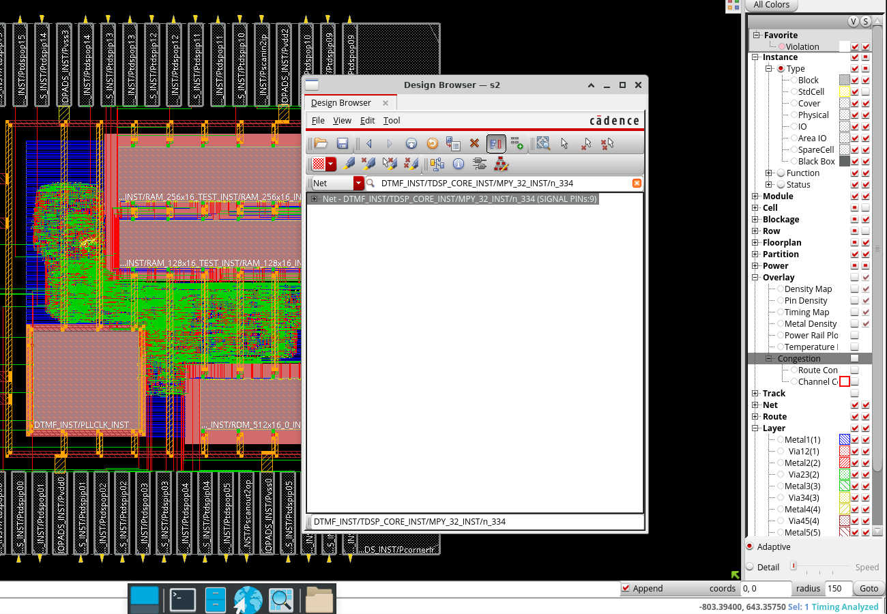

# Early Global Route — dtmf_recvr

Route feasibility analysis using the Early Global Router in Cadence Innovus. Covers placement optimization, scan chain inspection, eGR execution, and congestion analysis.

---

## Placement Optimization

Start Innovus, source the setup file to load libraries and I/O DEF, then load the floorplan:

```tcl
innovus -stylus
source dtmf.setup
# File → Load → Floorplan → dtmf.fp
read_def scan_input.def
```

Placement attributes are inspected and left at defaults via **Tools → Global** (filter: `place`):

| Attribute | Value |
|---|---|
| `place_global_cong_effort` | auto |
| `place_global_timing_effort` | medium |
| `place_global_ignore_scan` | true |
| `place_global_reorder_scan` | TRUE |



Run placement:

```tcl
place_opt_design
```





WNS is reported in the lower-right status bar post-run. A positive value confirms timing constraints are met at this stage.

Save scan DEF and database:

```tcl
write_def_by_section scan.def -no_nets -no_comp -scan_chains
write_db placeOpt.inn
```

---

## Scan Chain Inspection

Display scan chain `scan1` via **Place → Display → Scan Chain → Selected Scan Group**.

- `Instance` and `StdCell`: visible
- `Net` visibility: off





---

## Early Global Route

Open the eGR form via **Route → Early Global Route**. Routing layers are restricted to Metal1–Metal3 to force congestion to surface — excluding upper metals reveals placement-driven congestion they would otherwise absorb.

| Parameter | Setting |
|---|---|
| Routing Layer Min | Metal1(1) |
| Routing Layer Max | Metal3(3) |



Click **OK** to run, then refresh the Physical view with the redraw icon.

---

## Congestion Analysis

Enable **Overlay → Congestion → Route Con** under All Colors.

Congestion notation:

| Label | Meaning |
|---|---|
| `V: req/avail` | Vertical tracks — required vs. available |
| `H: req/avail` | Horizontal tracks — required vs. available |

Severity increases left to right: **blue → green → yellow → red → magenta → grey → white**

Three display modes are available in the Congestion Map pane:

| Mode | Behavior |
|---|---|
| eGR-3D | Default; line markers per layer with V:/H: severity labels |
| eGR-2D Diamond | Per-GCell diamonds; color encodes average congestion |
| eGR-2D Line | Separate overlays for vertical and horizontal congestion |





Vertical congestion color at Level 6 was changed to brown via **All Colors → View-Only → Vertical Congest → Level 6**:



Save:

```tcl
write_db earlyGlobalRouted.inn
```

---

## Net Inspection

Nets routed by the Early Global Router carry `Wire Status: Unknown` — as opposed to `Routed` or `Fixed` for detail-routed wires. This is the key signal distinguishing eGR output from detail route output.

**Via Object Attributes:** double-click any wire segment and check the `status` field.

**Via Q hover:** press `Q` and mouse over wires — status appears inline without opening a form.

Net `DTMF_INST/TDSP_CORE_INST/MPY_32_INST/n_334` was located and selected via **Tools → Design Browser → Find: Net**:



Use **Zoom Selected** to center the net, and **Fn + F12** to dim the background. Zooming in reveals the stipple pattern on each wire segment, which encodes the layer it is routed on.

Save final checkpoint:

```tcl
write_db pr.inn
```

---

## Output Files

| File | Description |
|---|---|
| `scan.def` | Scan chain DEF — no nets, no components |
| `placeOpt.inn` | DB after placement optimization |
| `earlyGlobalRouted.inn` | DB after Early Global Route |
| `pr.inn` | Final checkpoint |
